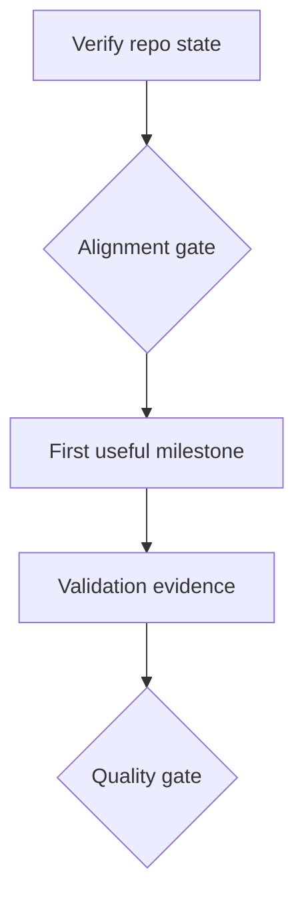

# KANBAN.md

Generated on 2026-06-10 from `closedloop-projects/PROJECTS.yaml` and the local goal-to-plan / kanban-dag rubrics.

## Scope

This repo is associated with:

- `robosteading` — RoboSteading

## Ready

| ID | Task | Owner Type | Acceptance Criteria | Canonical Plan |
| --- | --- | --- | --- | --- |
| ROBOSTEADING-M0-T1 | Verify RoboSteading current repo/domain state | Agent | Repo evidence and domain mapping checked against canonical plan. | [Plan](../../closedloop-projects/plans/projects/robosteading/KANBAN.md) |

## Backlog

| ID | Task | Dependencies | Acceptance Criteria | Evidence |
| --- | --- | --- | --- | --- |
| ROBOSTEADING-M1-T1 | Execute first useful milestone for RoboSteading | M0-T1 | First thin-slice artifact exists and passes project gate. | Demo, test, doc, or operator evidence. |

## Review / Gates

| ID | Gate | Decision Owner | Evidence Required | Decision Options |
| --- | --- | --- | --- | --- |
| ROBOSTEADING-G1 | RoboSteading alignment gate | Sean / project owner | Canonical GOAL.md, current repo evidence, open questions. | proceed / revise / pause |

## Blocked

| ID | Task | Blocker | Default Decision | Owner |
| --- | --- | --- | --- | --- |
| REPO-B1 | Resolve repo/catalog mismatch | Repo state may diverge from generated portfolio plan. | Treat current repo evidence as authoritative and update catalog/plans. | Agent + human |

## Dependency DAG

## Critical Path

1. Verify current repo state.
2. Reconcile with canonical generated plan.
3. Pass alignment gate.
4. Execute first useful milestone.
5. Produce validation evidence.
