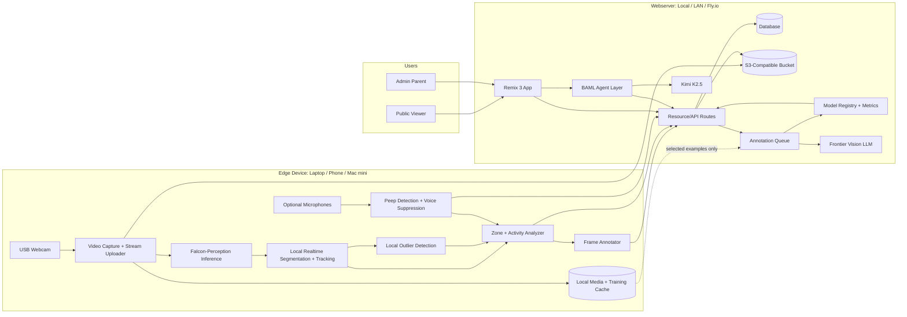

# PRD: BroodCast

## 1. Product summary

**BroodCast** is a local-first chick monitoring, annotation, and training system that starts as
a weekend-built web app and grows into a per-family, per-location learning loop.

An edge device watches a temporary chick brooder or chicken location. The edge device may be a
local laptop, phone, Mac mini, small desktop, or similar device connected to at least one webcam and
optionally one or more microphones. A Python capture/inference service on that edge device reads
video and audio, streams allowed video/media to the webserver, runs local vision and peep-detection
pipelines, and pushes structured observations to a **Remix 3** webserver. The webserver may run on
the same machine, a different computer on the local network, or a cloud host such as **Fly.io**. It
owns the public/admin UI, authenticated APIs, S3-compatible bucket storage for images and video,
and a database that chat agents and the webserver can query for key statistics, outliers,
annotations, model metadata, and behavior history.

The audio path is privacy-preserving by design. The edge service must run audio through a local
**peep-detection** algorithm that removes or suppresses human voices while preserving as much
animal sound signal as possible: peeps, squeals, distress cues, and related frequency/energy
features. Spoken language must not be extractable from anything sent to the webserver. Raw audio,
voice clips, transcripts, voiceprints, or human-speech features are never streamed to the app.
Visitors can watch a kid-friendly annotated stream, inspect a peep spectrum, and ask questions
about the chicks through a chatbot powered by **Kimi K2.5** and **BAML**. Admin users currently use
a temporary token gate; production admin access should become gated auth later.

Longer term, the app must support a family with one or more named chick locations, such as
brooders, coops, runs, or quarantine pens. Cameras are attached to locations for spans of time, but
they are not assumed to be stable: they can move, fall, be replaced, change angle, or point at a
different physical area. The stable product concepts are family, location, named chickens, local
sensor streams, observations, object detections, scene events, annotations, and model versions.

The training philosophy is online, local-first, and human-in-the-loop. Off-the-shelf vision models
are useful bootstrap tools, but they should not be trusted to provide high-F1 real-time annotations
for every family's coop without local calibration and continued learning. The system should use
local realtime models for segmentation, behavior statistics, and anomaly detection; human
annotations from the website to correct and enrich labels; and frontier vision LLMs only during
explicit training or audit moments when selected frames/clips are allowed to leave the local
environment. Video may be streamed or uploaded to the configured webserver for live viewing and
storage. Raw audio should remain local; uploaded audio-derived data must be peep-filtered,
voice-suppressed, and non-reconstructable as spoken language.

The product is observational only. It does not control heat, food, water, lights, motors, or any physical system.

## 1.1 Target architecture clarification

BroodCast is split into three operational layers:

1. **Edge capture/inference device.** A Python service runs near the animals on a laptop, phone,
   Mac mini, small desktop, or similar edge device. It is connected to at least one webcam and may
   use optional microphones. It reads video/audio, performs local privacy filtering and inference,
   and pushes media and structured outputs to the webserver.
2. **Webserver.** The Remix webserver may run locally, elsewhere on the LAN, or in the cloud. It
   exposes token-protected ingestion APIs, public/admin pages, chat-agent routes, media access, and
   query APIs for recent and historical behavior.
3. **Persistence.** The webserver uses S3-compatible bucket storage for images and video, plus a
   database for observations, annotations, peep metrics, outliers, model versions, calibration
   metadata, and statistics used by the web UI and chat agents.

Video and audio enter the system at the edge device. Video follows two paths in parallel:

* A direct stream/upload path to the webserver for live viewing and bucket-backed storage.
* A web-annotation path where frames are segmented, annotated, scored, and reduced to structured
  metrics and outliers. The annotated frame plus structured annotation payload are pushed to the
  webserver and persisted for querying.

Audio is processed locally before anything leaves the edge device. The peep-detection algorithm
must preserve animal peeps, squeals, distress indicators, and coarse frequency/energy signals while
removing or suppressing human voices. The webserver may receive derived peep events, aggregate
statistics, and coarse spectra that are useful for the live spectrogram and chat context, but spoken
language must not be extractable from uploaded data.

## 1.2 Current implementation state

As of the current repo state, BroodCast has an end-to-end weekend MVP scaffold inside the existing
RoboSteading site.

Shipped locally:

* The original RoboSteading homepage remains at `/`.
* BroodCast is mounted under `/broodcast`.
* Public live view exists at `/broodcast/live`.
* Admin dashboard exists at `/broodcast/dashboard`.
* Temporary admin token login exists at `/broodcast/login`.
* Report page exists at `/broodcast/report`.
* Local file/in-memory persistence stores observations, manual notes, zones, and visibility state.
* Observation ingest APIs are available at both `/api/ingest/observation` and `/broodcast/api/ingest/observation`.
* Latest/recent observation, chat, manual note, zone, and report APIs exist under `/broodcast/api/...`.
* Chat uses Fireworks Kimi through `FIREWORKS_API_KEY`, `KIMI_BASE_URL`, and `KIMI_MODEL`, with a conservative local fallback if the API call fails.
* Annotation assist uses BAML; runtime chat currently calls Fireworks directly while keeping the same answer shape.
* Safety docs, weekend runbook, and report template exist in `docs/`.
* A Python worker scaffold exists in `services/inference/`.
* Audio spectrum ingestion endpoints exist for Python-fed live visualization, but full
  privacy-preserving peep detection is still planned. It should run as local audio feature
  extraction in the Python edge service, not as server-side raw audio processing.

Current intentional shortcuts:

* Auth is a temporary token gate, not magic-link auth.
* Persistence is local JSON-backed state under `tmp/`, not the target database and bucket storage.
* The Python edge service currently runs as a local process, not a full media server.
* The Python worker can capture webcam frames with OpenCV and supports fake/manual detection, YOLO,
  RF-DETR, and Falcon-Perception paths with fallbacks.
* Video is currently snapshot-based. The next media milestone should preserve short video clips and
  highlight major scene changes before deciding whether to reduce retained media later.
* The app is not production-hardened; the priority is an end-to-end weekend loop.

## 1.3 Product owner implementation decisions

These decisions supersede the heavier production recommendations elsewhere in this PRD for the
current weekend build:

* Prioritize getting the full loop working end to end over production features.
* Use file/in-memory storage first instead of Supabase/Postgres.
* Use a simple temporary password/token admin gate before adding a stronger gated-auth path.
* Build a practical edge Python service scaffold now: webcam capture, fake/manual detector,
  annotation, and push client.
* Add peep tracking as a local privacy-preserving audio feature extractor: webcam/laptop mic input,
  band-limited chick peep detection, event counts/intensity/coarse spectra, human-voice suppression,
  and no raw or speech-reconstructable audio upload.
* Treat YOLO/RF-DETR as practical local detector defaults for the immediate demo and Falcon-
  Perception as an experimental/fast-follow detector path.
* Keep the edge worker/service able to push observations to Remix even before a richer Python media
  server exists.
* Use BAML/Kimi as the intended chat stack, with Fireworks Kimi configured through `FIREWORKS_API_KEY`.
* Use `accounts/fireworks/models/kimi-k2p6` as the default Kimi model.
* Keep conservative fallback behavior for chat and detection so the demo works even when model setup is incomplete.

## 1.4 Long-term product direction

BroodCast should evolve from a single-brooder demo into a family-owned observation and model
training system.

Core long-term assumptions:

* A family may have multiple active chicken locations.
* Each location has its own zones, camera history, named chickens, lighting patterns, background
  objects, and behavior baselines.
* Cameras are replaceable and unstable. A camera view is an input stream attached to a location for
  a time range, not the canonical identity of the location.
* Named chickens are user-owned entities. Their identities may be uncertain in video and should be
  represented with confidence, not forced into false precision.
* Video may be streamed or uploaded to the configured webserver for live viewing and storage, but
  training/export/frontier-LLM use remains explicit and scoped. Raw audio stays local; only
  voice-suppressed, non-reconstructable peep-derived data may leave the edge device.
* Statistics must be tied to the model, calibration, camera, and location context that produced
  them so future model upgrades do not silently rewrite historical meaning.
* The system should improve through online, per-location training loops instead of assuming one
  global model will perform well in every coop.

---

# 2. Goals

## Primary goal

Build a working public web app this weekend where parents, kids, classmates, and a broader
education-friendly audience can:

1. View a near-live annotated webcam feed of the chicks.
2. See whether the household is following the classroom chick care agreement.
3. Ask a chatbot questions about what the chicks are doing.
4. Generate a simple “weekend chick care report.”
5. See chick peep activity over time without streaming household audio or human voices.

The top-level product question is not "Are the chicks happy?" as a vague metric. BroodCast should
optimize for:

```text
Are we following the classroom care agreement?
```

The comfort score remains useful as a supporting observation signal, but care compliance is the
primary product surface.

## Secondary goal

Create a reusable **Robosteading / Null Robot / Divot-style** pattern:

> Observe a real-world activity → annotate it → explain it → coach the human → produce a useful report.

## Long-term goal

Create a local-first learning system that can produce stable, high-F1 chicken-care statistics for a
specific family's locations over time:

1. Segment chicks, feeders, drinkers, bedding, heat zones, doors, and other relevant objects.
2. Track behavior statistics such as percent time feeding, percent time drinking, movement volume,
   occupancy heatmaps, and pooping events.
3. Track audio-derived signals such as peeping frequency by time of day, temperature, and location
   context without uploading raw audio.
4. Detect outliers such as escaped chickens, predator or pet intrusion, camera displacement,
   abnormal inactivity, crowding, or a fallen camera.
5. Track human-care context such as hands in the brooder, people present, cleaning events, bedding
   changes, food/water refills, and direct checks without identifying people.
6. Use human corrections and selected frontier-LLM annotations to continuously improve local models
   for each location.

## Non-goals

Do **not** build:

* Automated feeding.
* Automated watering.
* Automated heating control.
* Any actuator inside the brooder.
* Veterinary diagnosis.
* High-accuracy individual chick identity tracking.
* Overbuilt production-grade broadcast infrastructure before the direct video stream/upload path is
  working.
* A complex multi-agent orchestration system.
* Native mobile apps.
* Indiscriminate raw video surveillance or any raw audio surveillance.
* A centralized model that requires all household media to be uploaded.
* Fully autonomous decisions about animal care.

---

# 3. Product principles

## 3.1 Null Robot principle

Prefer observation and coaching over physical actuation.

The system should behave like a “robot” because it closes a perception → interpretation → human action loop, not because it moves hardware.

## 3.2 Divot principle

Like a golf swing coach, BroodCast watches the activity and explains what it sees.

For chicks, that means:

* Where are they?
* Are they near the heater?
* Are they eating/drinking?
* Are they active or resting?
* Is there anything a human should check?

## 3.3 Robosteading principle

This is practical household/farm automation for care, learning, and gentle stewardship.

The app should help humans become more attentive caregivers, not replace them.

## 3.4 Local-first learning principle

Raw media is sensitive household data. Video may be streamed or uploaded to the configured
webserver for live viewing and bucket-backed storage, but it should remain governed by explicit
location, retention, and training-use policy. Audio buffers and microphone-derived features that
could reconstruct speech must remain on the edge device.

The webserver should receive allowed video/media, structured observations, derived metrics,
annotated frames, human annotations, and model metadata. Sending selected raw frames or short clips
to a frontier vision LLM is allowed only as an explicit training, labeling, or audit action. Audio
uploads are limited to voice-suppressed, non-reconstructable peep events, aggregate metrics, and
coarse spectra.

## 3.5 Location-first modeling principle

A location is more stable than a camera. Statistics, zones, and model baselines should be organized
around brooders, coops, runs, and other named places where chickens live.

Camera records should include calibration, view geometry, active time range, and health status. If a
camera moves or falls, the system should detect the shift, mark downstream observations as degraded,
and avoid blending incompatible statistics.

## 3.6 Human-in-the-loop training principle

The system should treat model output as a hypothesis until it has enough location-specific evidence.

Human annotations from the website are first-class training data. Frontier LLM vision annotations
can help bootstrap labels, explain uncertain clips, and audit model errors, but they should not
replace caregiver review for safety-relevant labels. Training should prioritize high-value examples:
low confidence frames, model disagreements, new camera angles, unusual events, edge cases, and
examples that affect reported statistics.

## 3.7 Classroom care agreement principle

The operational rules for this build come from the **Classroom Chick Care Agreement (Silkie Chicks -
11 Days Old)** sheet. BroodCast should encode sections 1-12 as checklist items, reminders, report
evidence, and chat-agent rules:

1. Heat.
2. Food and water.
3. Safe environment.
4. Handling.
5. Siblings.
6. Outdoor time.
7. Indoor safety.
8. Nighttime routine.
9. Cleaning.
10. Transport back to school.
11. Never leave unattended.
12. Take pictures and have fun.

The app should treat camera monitoring as a care aid, not adult supervision. It should explicitly
say:

```text
Camera monitoring does not count as adult supervision. Please check the chicks directly.
```

The most important compliance rule is: never leave the chicks unattended.

---

# 4. Target users

## 4.1 Primary users

### Parent/admin

The parent sets up the camera, starts the edge service, checks observations, and manages the public live page.

Needs:

* Simple setup.
* Safety guardrails.
* Magic-link login.
* Ability to add manual notes.
* Ability to generate a report.

### Kids/classmates

They view the live page and ask questions.

Needs:

* Friendly explanations.
* Visual annotations.
* Simple stats.
* Fun but safe learning experience.

### Teacher

Receives a weekend care report.

Needs:

* Summary of chick behavior.
* Evidence that the chicks were monitored.
* Kid-friendly observations.
* No overclaiming or unsafe automation.

---

# 5. User stories

## Public live viewer

1. As a visitor, I can open `/broodcast/live` and see the latest annotated brooder image.
2. As a visitor, I can see where each chick currently appears to be.
3. As a visitor, I can see a comfort score and recent activity summary.
4. As a visitor, I can ask, “Are the chicks too cold?” and receive a grounded answer based on recent observations.
5. As a visitor, I can ask, “What are they doing right now?” and receive a plain-language explanation.
6. As a visitor, I can see recent peep activity as event counts or trend labels, not as playable audio.

## Admin

1. As an admin, I can log in using a magic link.
2. As an admin, I can view recent observations and raw stats.
3. As an admin, I can add manual notes such as “checked water at 7:30 PM.”
4. As an admin, I can configure or edit brooder zones.
5. As an admin, I can generate a report for the class.
6. As an admin, I can pause public visibility if needed.
7. As an admin, I can see a privacy status confirming that peep tracking uploads only derived events, not raw microphone audio.
8. As an admin, I can create named locations such as "garage brooder" or "main coop."
9. As an admin, I can attach a camera to a location and recalibrate zones when the camera moves.
10. As an admin, I can name chickens and correct uncertain identity labels without requiring the
    system to be certain on every frame.
11. As an admin, I can complete a care checklist based on the classroom care agreement.
12. As an admin, I can record water, food, heat, bedding, pet-safety, handling, outdoor-time,
    nighttime, cleaning, transport, and adult-check events.
13. As an admin, I can see reminders when water, food, or adult checks have not been confirmed
    recently.

## Local system operator

1. As the operator, I can run a local webcam worker from my laptop.
2. The worker captures frames every 2–5 seconds.
3. The worker runs Falcon-Perception locally against snapshots.
4. The worker sends observation JSON and latest annotated frames to the deployed app.
5. The worker samples the local microphone, filters for likely chick peep frequencies, and sends only timestamped peep events or aggregate peep stats.
6. If inference or audio detection fails, the app still shows the last known frame and a stale-data warning.
7. The worker can detect when the camera view has changed enough to require recalibration.
8. The worker can keep raw media local while exporting selected examples for labeling or training.

## Annotation and training operator

1. As an admin, I can review uncertain frames, clips, masks, behavior labels, and anomaly candidates.
2. As an admin, I can correct segmentation masks, bounding boxes, zones, named chicken identity,
   behavior labels, and anomaly labels.
3. As an admin, I can annotate cleaning events, bedding changes, food refills, water refills, and
   direct human checks with start/end times and affected zones.
4. As an admin, I can label hands and people as care-context objects without identifying the person.
5. As an admin, I can approve a selected frame or short clip for frontier-LLM annotation.
6. As an admin, I can see whether an annotation came from a human, a local model, or a frontier LLM.
7. As an admin, I can export a per-location training manifest for the local inference worker.
8. As an admin, I can compare a candidate model against the current model before promoting it.
9. As an admin, I can see which model version produced each reported statistic.

---

# 6. Milestones

The product should move in deliberate milestones. Anything after Milestone 3 is still speculative
until the observed demo loop proves useful with a real household brooder and a broader educational
audience.

## Milestone 0: Local Scaffold

Status: mostly shipped.

Goal: prove the end-to-end loop on one machine or LAN.

Scope:

* `/broodcast/live`, `/broodcast/dashboard`, `/broodcast/login`, and `/broodcast/report`.
* Root `/api/*` ingestion aliases for the Python worker.
* Snapshot-based annotated frame updates.
* Temporary token admin access.
* Local JSON/file state.
* Manual notes, public visibility toggle, zone JSON editor, report page, and chat fallback.
* Python webcam capture with fake/manual, YOLO, RF-DETR, and Falcon detector paths.
* Annotation lab, chick naming, and BAML-backed annotation assist.
* Audio spectrum ingestion and display for Python-fed peep-spectrum visualization.

Exit criteria:

* The worker can push real or fake webcam observations to Remix.
* `/broodcast/live` updates without manual refresh.
* Chat answers cite recent observations and stay conservative.
* Public UI clearly states that BroodCast is observational only.

## Milestone 1: Public Educational Demo

Goal: make BroodCast useful and understandable for parents, kids, classmates, and a broader
education-friendly audience.

Scope:

* BroodCast is the only user-visible product name.
* `/broodcast/live` is the canonical public route.
* Keep public access open for now; add gated access later after the demo loop is stable.
* Show latest annotated frame, chick labels, zone labels, comfort score, recent stats, and peep
  spectrum.
* Keep the score label as "comfort score" in user-facing UI, with supporting safety copy that it is
  not a health diagnosis.
* Add a Care Checklist panel driven by the classroom care agreement.
* Make compliance status more prominent than the comfort score.
* Keep chatbot access public for the demo, with conservative safety escalation and no medical
  claims.
* Make the report kid-friendly and classroom-shareable.
* Preserve video clips or scene-change clips where practical; highlight large screen/camera changes
  instead of reducing media retention too early.

Exit criteria:

* A viewer can understand what BroodCast sees without admin context.
* The dashboard answers "Are we following the classroom care agreement?"
* The public page has no raw audio playback or download affordance.
* The page remains useful when the worker is stale or temporarily offline.
* The report can be shared with a teacher without overclaiming model accuracy.

## Milestone 2: Audio And Media Hardening

Goal: keep the educational peep spectrum while making the privacy boundary explicit and enforceable.

Scope:

* Move from generic spectrum frames toward local peep-event extraction in `services/inference/`.
* Preserve peep spectrum visualization, but only from coarse, non-reconstructable bins or derived
  event aggregates.
* Upload peep counts, rates, dominant frequency bucket, intensity bucket, confidence, and trend.
* Do not upload raw audio, encoded audio, speech transcripts, voiceprints, or speech-reconstructable
  features.
* Add visible privacy status: "No raw audio uploaded."
* Add video clip preservation for now, especially short clips around major scene changes, camera
  movement, missing-chick events, and unusual activity.

Exit criteria:

* The Python worker discards raw microphone buffers after local analysis.
* The webserver cannot replay, download, or reconstruct audio.
* Peep data appears as approximate behavior signal, not diagnosis.
* Video clip retention policy is explicit even if still local/file-backed.

## Milestone 3: Gated Admin And Calibration

Goal: make the public demo safer to operate without overbuilding production infrastructure.

Scope:

* Add stronger gated admin access, likely magic-link auth or equivalent.
* Keep public viewing open by default, but support gated/private mode.
* Persist structured care-compliance events and checklist state.
* Replace JSON-only zone editing with a visual calibration UI.
* Add location, camera, camera attachment, calibration version, model version, and view-health
  fields to observations.
* Detect major camera movement, camera blockage, and fallen-camera states.
* Move annotation lab behind admin or reviewer access unless intentionally opened for classroom
  labeling.

Exit criteria:

* Admin-only actions are no longer protected only by a shared token.
* A camera move marks downstream observations as degraded until recalibrated.
* Public/private visibility behavior is predictable.

## Milestone 4: Persistence And Querying

Goal: replace local scratch state with durable media and queryable structured history.

Scope:

* S3-compatible bucket storage for images and video clips.
* Database-backed observations, detections, annotations, peep metrics, outliers, model metadata,
  chat context, and reports.
* Retention policy for raw frames, annotated frames, and clips.
* Query APIs for reports, chat evidence, peep trends, zone occupancy, and notable events.
* Keep public pages from exposing private raw clips by default.

Exit criteria:

* Restarting the app does not lose observations or annotations.
* Reports can summarize a chosen date/time window.
* Chat can cite durable observations and manual notes.

## Milestone 5: Learning System

Status: speculative target architecture.

Goal: evolve from one brooder demo into a per-family, per-location model-improvement loop.

Scope:

* Families, locations, cameras, camera attachments, named chickens, model versions, training
  examples, scene events, and annotation provenance.
* Human-reviewed annotations as first-class training data.
* Explicit approval before selected frames or clips are sent to frontier vision LLMs.
* Per-location training manifests for local models.
* Candidate model evaluation before promotion.
* Model-versioned historical statistics.

Exit criteria:

* A promoted model can be traced to training data and evaluation metrics.
* Historical statistics are tied to the model, camera, calibration, and location context that
  produced them.
* Frontier LLM use remains explicit, scoped, and auditable.

---

# 7. Classroom Care Compliance

BroodCast should encode the classroom care sheet as a concrete compliance model. For MVP, most
checks are manual buttons or checklist items. Vision and audio can provide supporting cues, but the
app should not rely on model output alone for care compliance.

## 7.1 Compliance metrics

### Heat source active

The care sheet says to plug in the heat lamp as soon as the chicks arrive home and keep the chicks
warm. In the current setup, this maps to the heating plate, not a lamp.

Metric:

```text
heat_source_status: active | unknown | needs_check
```

MVP measurement:

* Manual check: parent confirms the heat source is plugged in and working.
* Optional sensor: temperature near the heater zone.
* Vision cue: chicks spending too much time huddled near the heater may indicate cold.

Dashboard card:

```text
Heat: Checked / Needs check
```

### Fresh water available

Metric:

```text
water_check_status: checked | needs_check
last_water_check_at: timestamp
```

MVP measurement:

* Manual button: "Water checked."
* Optional vision: waterer present, but do not rely on it.

Reminder rule:

```text
If last_water_check_at > 4 hours ago -> remind adult to check water.
```

### Chick mash available

Metric:

```text
food_check_status: checked | needs_check
last_food_check_at: timestamp
```

MVP measurement:

* Manual button: "Food checked."
* Optional vision: feeder visible or chicks near feeder.

Reminder rule:

```text
If last_food_check_at > 4 hours ago -> remind adult to check food.
```

### No unauthorized food

Printed instruction: do not give the chicks any other food. The handwritten note says corn cobs and
watermelon rinds are okay. Treat this as:

```text
default_rule: chick mash only
teacher_exception: corn cobs and watermelon rinds appear approved by handwritten note
```

Metric:

```text
extra_food_given: none | corn_cob | watermelon_rind | other
```

Required app wording:

```text
Default rule: only chick mash. The care sheet has a handwritten exception saying corn cobs and
watermelon rinds are okay. Do not give any other food unless an adult confirms with the teacher.
```

### Secure enclosure and indoor safety

Metrics:

```text
enclosure_status: secure | needs_check | unknown
indoor_roaming_status: not_roaming | unknown | violation
```

MVP measurement:

* Manual check.
* Optional camera cue: chicks detected inside brooder zones.

Alert rule:

```text
If chick_count < 2 for repeated frames -> "Check that both chicks are safely inside the bin."
```

### Warm, draft-free area

Metrics:

```text
ambient_status: ok | too_cold | too_hot | unknown
draft_risk: low | unknown
```

MVP measurement:

* Temperature sensor near brooder if available.
* Chick behavior:
  * Both always near heater: possible cold or draft.
  * Both far from heater: possible too warm.
  * Normal movement across zones: likely okay.

### Away from pets

Metric:

```text
pet_safety_status: confirmed | needs_check
```

MVP measurement: manual only.

Dashboard checkbox:

```text
[ ] Pets secured away from chicks
```

Reminder rule:

```text
If not checked recently -> show reminder, not alarm.
```

### Handling and siblings

Rules:

* Students must have adult supervision when holding chicks.
* Students should sit on the ground, criss-cross, feet tucked in.
* No walking around while holding chicks.
* Younger siblings may hold only with 100% adult supervision.

Metric:

```text
handling_mode: none | supervised | unknown
```

MVP event buttons:

```text
Started supervised handling
Ended supervised handling
```

Required chatbot answer when asked "Can I hold them?":

```text
Yes, only with adult supervision, while sitting on the ground criss-cross with feet tucked in. Do
not walk around while holding them.
```

### Outdoor time

Rules:

* Outdoor time may happen in a grassy backyard space.
* Outdoor time must be closely supervised.
* Never leave chicks unattended outside.

Metric:

```text
location_mode: indoor_brooder | outdoor_supervised | transport | unknown
```

MVP event buttons:

```text
Outdoor supervised time started
Outdoor supervised time ended
```

Reminder rule:

```text
If outdoor_supervised active for > 20-30 min -> remind adult to verify conditions.
```

### Nighttime routine

Rule: cover the bin with the provided blanket at bedtime to help the chicks feel safe and warm.

Metrics:

```text
night_cover_status: covered | not_covered | needs_check | unknown
bedtime_check_completed: true | false
```

MVP bedtime checklist:

```text
[ ] Food checked
[ ] Water checked
[ ] Heater checked
[ ] Bedding checked
[ ] Chicks counted: 2
[ ] Bin covered with blanket
```

If the blanket affects camera visibility, BroodCast should switch to night mode:

```text
Night mode: camera may be blocked by blanket. Use manual checks.
```

### Cleaning

Rules:

* Replace doggy pad papers.
* Clean fake grass using water and a cloth only, no chemicals.
* Shake it out and allow it to dry before placing it back.

Metrics:

```text
bedding_status: clean | soiled | needs_check | unknown
last_pad_change_at: timestamp
fake_grass_status: clean | drying | in_brooder | unknown
```

MVP event buttons:

```text
Pad replaced
Fake grass cleaned
Fake grass drying
Fake grass returned
```

Required chatbot answer when asked how to clean:

```text
Replace the doggy pad papers. Clean the fake grass with water and a cloth only. Do not use
chemicals. Let it dry before putting it back.
```

### Transport back to school

Rules:

* Before returning, remove heat source, water container, and food container.
* Place these items in the provided bag.
* This helps keep the chicks safe during transport.

Metric:

```text
return_transport_ready: true | false
```

Return checklist:

```text
[ ] Heat source removed
[ ] Water container removed
[ ] Food container removed
[ ] Items placed in provided bag
[ ] Chicks secured for transport
```

### Never unattended

This is a top-level compliance principle.

Metric:

```text
supervision_status: supervised | camera_only | needs_adult_check
```

Reminder rule:

```text
If no manual adult check for > 2-4 hours -> remind adult to check chicks directly.
```

## 7.2 Compliance state

```ts
type CareComplianceState = {
  heatSource: {
    status: "checked" | "needs_check" | "unknown";
    lastCheckedAt?: string;
  };

  food: {
    status: "checked" | "needs_check" | "unknown";
    lastCheckedAt?: string;
    extraFoodGiven?: "none" | "corn_cob" | "watermelon_rind" | "other";
  };

  water: {
    status: "checked" | "needs_check" | "unknown";
    lastCheckedAt?: string;
  };

  enclosure: {
    chickCount: number | null;
    status: "secure" | "needs_check" | "unknown";
  };

  environment: {
    ambientStatus: "ok" | "too_cold" | "too_hot" | "unknown";
    draftRisk: "low" | "unknown";
  };

  handling: {
    mode: "none" | "supervised" | "unknown";
    lastHandledAt?: string;
  };

  outdoorTime: {
    mode: "indoor_brooder" | "outdoor_supervised" | "transport" | "unknown";
    startedAt?: string;
  };

  cleaning: {
    beddingStatus: "clean" | "soiled" | "needs_check" | "unknown";
    lastPadChangeAt?: string;
    fakeGrassStatus: "clean" | "drying" | "in_brooder" | "unknown";
  };

  nighttime: {
    coverStatus: "covered" | "not_covered" | "needs_check" | "unknown";
    bedtimeChecklistComplete: boolean;
  };

  supervision: {
    lastAdultCheckAt?: string;
    status: "supervised" | "needs_adult_check" | "unknown";
  };
};
```

## 7.3 Dashboard care checklist

Add a **Care Checklist** panel:

```text
Daily Care
[ ] Heat source checked
[ ] Fresh water checked
[ ] Chick mash checked
[ ] Chicks counted: 2
[ ] Enclosure secure
[ ] Pets away
[ ] Bedding clean
[ ] Adult check completed

Handling
[ ] Only handled with adult supervision
[ ] Child seated criss-cross
[ ] No walking while holding chicks

Outdoor Time
[ ] Outdoor time supervised
[ ] Chicks never left outside unattended

Nighttime
[ ] Food checked
[ ] Water checked
[ ] Heat checked
[ ] Bedding checked
[ ] Bin covered with blanket

Cleaning
[ ] Doggy pad replaced if needed
[ ] Fake grass cleaned with water only
[ ] Fake grass fully dry before returning

Return to School
[ ] Heat source removed
[ ] Water container removed
[ ] Food container removed
[ ] Items placed in provided bag
```

The top-level dashboard should be compliance-first:

```text
BroodCast Compliance

Current status:
- Chicks detected: 2/2
- Heat checked: yes
- Water checked: 47 min ago
- Food checked: 47 min ago
- Last adult check: 47 min ago
- Enclosure: secure
- Current comfort signal: 4/5
- Active alerts: none
```

---

# 8. Safety requirements

## 8.1 Hard safety constraints

The system must never:

* Control heat.
* Control food.
* Control water.
* Control lights.
* Move any object inside the brooder.
* Tell users that chicks are definitely healthy.
* Replace adult supervision.
* Make veterinary diagnoses.
* Recommend risky interventions.
* Stream, store, or expose raw microphone audio.
* Store voice clips, speech transcripts, speaker identity, or other human-voice-derived content.

## 8.2 Audio privacy constraints

Peep tracking must be privacy-preserving by design.

Required behavior:

* Microphone processing runs locally in `services/inference/`.
* The worker applies voice suppression plus a band-pass filter and event detector tuned for chick
  peeps before upload.
* The API receives only derived values such as peep count, peep rate, dominant frequency bucket,
  peak level bucket, confidence, local timestamp, and coarse non-reconstructable spectra for live
  display.
* The worker must discard raw audio buffers after local analysis.
* The web app must not provide audio playback, raw waveform display, speech transcription, or
  downloadable audio.
* Spoken language must not be extractable from any uploaded peep event, metric, spectrum, or
  derived audio representation.
* Peep data should be labeled as an approximate behavioral signal, not a diagnosis.

Out of scope:

* Identifying human speakers.
* Identifying people by face, voice, gait, clothing, or biometric features.
* Storing face embeddings or person re-identification embeddings.
* Recording room audio.
* Streaming live raw audio or any representation that can reconstruct human speech.
* Classifying human speech content.

## 8.3 Video privacy and training constraints

Video may be streamed or uploaded from the edge device to the webserver for live viewing and
bucket-backed storage. Training use should still be consented, scoped, and model-versioned.

Required behavior:

* The edge service may process raw frames and clips locally for realtime inference, heatmaps,
  tracking, anomaly detection, and training-data selection.
* The web app should ingest direct video/media streams or uploads, structured observations, derived
  metrics, annotation metadata, model metadata, and annotated frames.
* Raw clips or high-resolution source frames may be persisted to bucket storage according to the
  configured live-view/storage policy. Sending selected media to a frontier vision LLM must remain
  an explicit annotation, training, audit, or support action.
* Training exports must record consent/source state, location, camera, timestamp, annotation source,
  and model version.
* Public pages must never expose private raw clips by default.
* If a camera falls, moves, or loses the expected view, observations from that period should be
  marked degraded and excluded from stable care statistics unless reviewed.

Out of scope:

* Always-on remote video recording.
* Uploading all camera footage for centralized training.
* Treating frontier-LLM annotations as automatically verified ground truth.
* Using people or hand detections to identify a specific person.
* Exposing person imagery or face crops publicly by default.

## 8.4 Required safety banner

Display on `/broodcast/live` and `/broodcast/dashboard`:

> BroodCast is an observational learning tool. It does not replace adult supervision. Always directly check food, water, temperature, bedding, and chick behavior.

## 8.5 Required agent behavior

The chatbot must always treat concerning situations conservatively.

Set `safety_level = "adult_attention"` when the user asks about or the observations suggest:

* Constant loud peeping.
* Lethargy.
* Injury.
* Wet bedding.
* No movement for a long time.
* No access to food or water.
* Possible overheating.
* Possible chilling.
* Trouble breathing.
* Pasting/pasty butt.
* Chick stuck, trapped, or separated.
* Unusual peep patterns, such as sustained high peep rate, sudden silence after active periods, or
  peep activity that conflicts with the visual comfort signal.

## 8.6 Required physical setup rules

Create `docs/SAFETY.md` with:

```md
# BroodCast Safety Rules

- This system is observational only.
- It does not control heat, food, water, doors, motors, lights, or any physical actuator.
- It must not be used as a substitute for adult supervision.
- Any alert is advisory.
- Human caregivers are responsible for checking food, water, temperature, bedding, and chick behavior.
- No wires, electronics, batteries, loose parts, or breadboards go inside the brooder.
- The webcam must be mounted outside or above the brooder.
- The chicks must always be able to freely move toward or away from the heat source.
```

---

# 9. System architecture

The architecture has three runtime layers:

* **Edge device:** a Python capture/inference service on a local laptop, phone, Mac mini, small
  desktop, or similar device connected to at least one webcam and optional microphones.
* **Webserver:** the Remix app and ingestion APIs running locally, elsewhere on the local network,
  or on a cloud host such as Fly.io.
* **Persistence:** S3-compatible bucket storage for images/video and a database for observations,
  annotations, peep metrics, outliers, model metadata, and chat-agent query context.

Weekend MVP still starts with one edge device, one location, snapshot observations, manual zones,
and simple reports. The target architecture adds direct video stream/upload, bucket-backed media,
database-backed statistics, annotation queues, training manifests, model registry, and
model-versioned behavior history.



Local realtime inference should optimize for latency and consistency. Direct video upload/streaming
is separate from the parallel annotation path so the live viewer can work even while segmentation
or outlier analysis is delayed. Frontier LLM vision should optimize for label quality on selected
examples, not for every-frame streaming inference. Audio leaving the edge device must be
peep-filtered, voice-suppressed, and non-reconstructable as spoken language.

## 9.1 Core long-term entities

* `family`: the account that owns locations, cameras, chickens, annotations, and models.
* `location`: a named physical place where chickens are observed, such as a brooder, coop, run, or
  quarantine pen.
* `camera`: a physical or logical camera stream that may be attached to different locations over
  time.
* `camera_attachment`: a time-bounded relationship between a camera and a location, including
  calibration, zones, expected view embedding, and health state.
* `chicken`: a named bird owned by the family, with optional identity evidence and confidence over
  time.
* `observation`: structured local model output for a timestamp, location, camera, and model version.
* `object_detection`: a per-frame object hypothesis such as chick, hand, person, feeder, drinker,
  bedding, egg, door, tool, predator, pet, or unknown object.
* `scene_event`: a temporal event inferred from one or more observations, such as cleaning, bedding
  change, food refill, water refill, direct check, chicken feeding, chicken drinking, pooping,
  escape, intrusion, or camera moved.
* `annotation`: human, local-model, or frontier-LLM label data tied to media, observation, and
  source.
* `training_example`: selected frame, clip, mask, label set, or audio-derived event used for
  training/evaluation.
* `model_version`: a local or shared model artifact with metrics, training data lineage, and
  deployment status.

---

# 10. Deployment architecture

## 10.1 Edge device

Runs:

* Webcam capture from at least one camera.
* Optional microphone capture.
* Direct video stream/upload client to the webserver.
* Local microphone peep-event detection with human-voice suppression.
* Falcon-Perception inference.
* Zone/activity analyzer.
* Outlier extraction.
* Frame annotation.
* Push client to the configured webserver URL.

The edge device may be a laptop, phone, Mac mini, small desktop, or similar device near the animals.
Reason: GPU/CPU-heavy vision/audio inference should run near the cameras and microphones, and
microphone audio must be filtered locally for privacy. Only derived peep events, coarse spectra,
aggregate peep metrics, annotated frames, video/media allowed by configuration, and structured
observation payloads are sent to the webserver.

## 10.2 Webserver

Runs:

* Remix 3 web app.
* API routes.
* Auth/session handling.
* Chat route.
* Database connection.
* S3-compatible bucket storage integration.
* Image/video upload and read endpoints.
* Query endpoints for chat agents and UI statistics.

The webserver can run on the same edge device, another computer on the local network, or a cloud
host such as Fly.io. It must not assume it has direct access to cameras or microphones.

## 10.3 Storage and database

Original production-oriented options:

### Option A: Postgres + local mounted Fly volume

Simpler, but less portable.

### Option B: Supabase

Recommended for speed:

* Supabase Auth magic links.
* Supabase Postgres.
* Supabase Storage for frames.
* Remix deployed on Fly.io.

### Option C: Neon + R2

Clean production-ish split, more setup.

Original recommended weekend path: **Supabase + Fly.io Remix app**.

Current selected path: **local JSON-backed file/in-memory storage + Remix app**.

Target production path: **S3-compatible bucket storage for images/video plus a database for
observations, annotations, metrics, outliers, calibration, model versions, chat-agent context, and
behavior history**.

Reason: the immediate priority is proving the product loop:

```text
edge webcam capture → direct video stream/upload + parallel annotation → Remix ingest → live view → chat explanation → report
```

Supabase/Postgres can replace the local store after the loop is working.

---

# 11. Pages and routes

Current route namespace: BroodCast is mounted under `/broodcast` so the original RoboSteading
homepage can remain at `/`.

## 11.1 `/`

RoboSteading landing page with a link to BroodCast.

Content:

* Existing RoboSteading mission content.
* Link to `/broodcast`.

## 11.2 `/broodcast/live`

Public page.

Components:

* `LiveStream`
* `ChickOverlay`
* `ChickStatsCards`
* `AskBroodCast`
* `SafetyBanner`
* `RecentObservations`

Required display:

```text
Current status:
- Last updated: X seconds ago
- Chicks detected: 2
- Comfort score: 4/5
- Chick 1: heater zone, resting
- Chick 2: turf zone, active
- Alerts: none
```

If stale:

```text
Stream may be stale. Last observation was 12 minutes ago.
```

## 11.3 `/broodcast/dashboard`

Admin-only.

Components:

* Authenticated layout.
* Current observation.
* Recent observation table.
* Peep activity chart and privacy status.
* Manual note form.
* Zone config editor.
* Stream health card.
* Report generation link.

## 11.4 `/broodcast/report`

Public or admin-shareable report page.

Shows:

* Date/time range.
* Total observations.
* Average comfort score.
* Peep activity timeline.
* Zone distribution.
* Notable events.
* Manual notes.
* Kid-friendly summary.

## 11.5 `/broodcast/login`

Magic-link login page.

Fields:

* Email input.
* Submit button.
* “Check your email” confirmation state.

## 11.6 `/auth/callback`

Production target: handles magic-link callback.

Current weekend implementation: not used because admin access is a temporary token gate.

---

# 12. API routes

## 12.1 `POST /api/ingest/observation`

Used by the edge Python capture/inference service.

Auth:

* Requires `STREAM_INGEST_TOKEN`.

Input:

```json
{
  "family_id": "family_local_dev",
  "location_id": "garage_brooder",
  "camera_id": "laptop_webcam_1",
  "camera_attachment_id": "garage_brooder_laptop_webcam_2026_05",
  "model_version_id": "local-yolo-rfdetr-2026-05-16",
  "calibration_version": "zones-2026-05-16-a",
  "timestamp": "2026-05-16T10:15:00Z",
  "frame_id": "frame_000123.jpg",
  "annotated_frame_url": "https://...",
  "raw_media_uploaded": false,
  "view_health": "ok",
  "comfort_score": 4,
  "summary": "Two chicks detected. One near heater, one on turf.",
  "alerts": [],
  "stats": {
    "chick_count": 2,
    "heater_zone_pct_10m": 0.42,
    "food_water_zone_pct_10m": 0.18,
    "movement_score": 0.31,
    "feeding_time_pct_10m": 0.12,
    "drinking_time_pct_10m": 0.04,
    "poop_events_10m": 1,
    "occupancy_heatmap_id": "heatmap_000123",
    "peep_count_10m": 38,
    "peep_rate_per_minute": 3.8,
    "peep_intensity": "moderate",
    "peep_trend": "steady"
  },
  "objects": [
    {
      "track_id": "hand_1",
      "class": "hand",
      "zone": "food_water",
      "bbox": [80, 610, 230, 760],
      "mask_ref": "local_or_uploaded_mask_id",
      "confidence": 0.88,
      "privacy": {
        "biometric_identity_allowed": false,
        "publicly_visible": false
      }
    },
    {
      "track_id": "person_1",
      "class": "person",
      "zone": "outside_brooder",
      "bbox": [0, 120, 180, 720],
      "confidence": 0.74,
      "privacy": {
        "biometric_identity_allowed": false,
        "publicly_visible": false
      }
    }
  ],
  "events": [
    {
      "event_type": "cleaning",
      "started_at": "2026-05-16T10:13:40Z",
      "ended_at": "2026-05-16T10:15:00Z",
      "zone": "food_water",
      "actor_type": "human",
      "evidence_object_track_ids": ["hand_1"],
      "confidence": 0.71,
      "review_state": "needs_review"
    }
  ],
  "audio": {
    "source": "local_mic_frequency_filter",
    "raw_audio_uploaded": false,
    "human_voice_uploaded": false,
    "window_seconds": 60,
    "sample_rate_hz": 16000,
    "filter_band_hz": [1800, 6500],
    "events": [
      {
        "timestamp": "2026-05-16T10:14:42Z",
        "duration_ms": 180,
        "dominant_frequency_hz": 3400,
        "peak_level_dbfs": -28,
        "confidence": 0.76
      }
    ]
  },
  "detections": [
    {
      "track_id": "chick_1",
      "chicken_id": "henrietta",
      "identity_confidence": 0.64,
      "zone": "heater",
      "bbox": [420, 300, 510, 390],
      "centroid": [465, 345],
      "activity": "resting",
      "mask_ref": "local_or_uploaded_mask_id",
      "confidence": 0.82
    },
    {
      "track_id": "chick_2",
      "chicken_id": null,
      "identity_confidence": 0.22,
      "zone": "turf",
      "bbox": [610, 350, 700, 440],
      "centroid": [655, 395],
      "activity": "active",
      "confidence": 0.79
    }
  ]
}
```

Response:

```json
{
  "ok": true,
  "observation_id": "uuid"
}
```

## 12.2 `GET /api/latest`

Returns latest observation.

## 12.3 `GET /api/observations?minutes=30`

Returns recent observations.

## 12.4 `GET /api/peeps?minutes=60`

Returns recent peep activity derived from ingested observation stats.

Output:

```json
{
  "minutes": 60,
  "raw_audio_available": false,
  "events": [
    {
      "timestamp": "2026-05-16T10:14:42Z",
      "duration_ms": 180,
      "dominant_frequency_hz": 3400,
      "peak_level_dbfs": -28,
      "confidence": 0.76
    }
  ],
  "buckets": [
    {
      "start": "2026-05-16T10:10:00Z",
      "end": "2026-05-16T10:15:00Z",
      "peep_count": 18,
      "peep_rate_per_minute": 3.6,
      "peep_intensity": "moderate"
    }
  ]
}
```

## 12.5 `POST /api/chat`

Input:

```json
{
  "session_id": "public-session-id",
  "message": "Are the chicks too cold?"
}
```

Output:

```json
{
  "answer": "They may be cool, but the evidence is not conclusive...",
  "confidence": "medium",
  "safety_level": "normal",
  "suggested_checks": [
    "Check the brooder thermometer.",
    "Listen for loud constant peeping.",
    "Make sure both chicks can move away from the heater."
  ],
  "evidence": [
    "Both chicks spent 64% of the last 10 minutes near the heater.",
    "Movement score is low, consistent with resting."
  ],
  "follow_up_questions": [
    "Would you like a bedtime checklist?"
  ]
}
```

## 12.6 `POST /api/manual-notes`

Admin-only.

Input:

```json
{
  "note": "Checked food and water at 7:30 PM. Both full.",
  "visibility": "public"
}
```

## 12.7 `GET /api/report?date=YYYY-MM-DD`

Returns report data.

---

# 13. Database schema

Use Postgres.

```sql
create table users (
  id uuid primary key,
  email text unique not null,
  role text not null default 'viewer',
  created_at timestamptz default now()
);

create table families (
  id uuid primary key default gen_random_uuid(),
  name text not null,
  created_at timestamptz default now()
);

create table locations (
  id uuid primary key default gen_random_uuid(),
  family_id uuid not null references families(id) on delete cascade,
  name text not null,
  kind text not null default 'brooder',
  active boolean not null default true,
  metadata jsonb not null default '{}',
  created_at timestamptz default now(),
  updated_at timestamptz default now()
);

create table cameras (
  id uuid primary key default gen_random_uuid(),
  family_id uuid not null references families(id) on delete cascade,
  name text not null,
  device_fingerprint text,
  active boolean not null default true,
  metadata jsonb not null default '{}',
  created_at timestamptz default now(),
  updated_at timestamptz default now()
);

create table camera_attachments (
  id uuid primary key default gen_random_uuid(),
  camera_id uuid not null references cameras(id) on delete cascade,
  location_id uuid not null references locations(id) on delete cascade,
  started_at timestamptz not null,
  ended_at timestamptz,
  calibration_version text,
  expected_view jsonb not null default '{}',
  view_health text not null default 'unknown',
  metadata jsonb not null default '{}'
);

create table chickens (
  id uuid primary key default gen_random_uuid(),
  family_id uuid not null references families(id) on delete cascade,
  name text not null,
  active boolean not null default true,
  identity_notes text,
  metadata jsonb not null default '{}',
  created_at timestamptz default now(),
  updated_at timestamptz default now()
);

create table model_versions (
  id uuid primary key default gen_random_uuid(),
  family_id uuid references families(id) on delete cascade,
  location_id uuid references locations(id) on delete set null,
  name text not null,
  model_type text not null,
  artifact_uri text,
  training_manifest_uri text,
  metrics jsonb not null default '{}',
  status text not null default 'candidate',
  created_at timestamptz default now(),
  promoted_at timestamptz
);

create table chick_observations (
  id uuid primary key default gen_random_uuid(),
  family_id uuid references families(id) on delete cascade,
  location_id uuid references locations(id) on delete set null,
  camera_id uuid references cameras(id) on delete set null,
  camera_attachment_id uuid references camera_attachments(id) on delete set null,
  model_version_id uuid references model_versions(id) on delete set null,
  created_at timestamptz default now(),
  observed_at timestamptz not null,
  frame_id text,
  annotated_frame_url text,
  raw_media_uploaded boolean not null default false,
  view_health text not null default 'unknown',
  calibration_version text,
  comfort_score int,
  summary text,
  alerts jsonb not null default '[]',
  stats jsonb not null default '{}'
);

create table chick_peep_events (
  id uuid primary key default gen_random_uuid(),
  observation_id uuid references chick_observations(id) on delete cascade,
  observed_at timestamptz not null,
  duration_ms int,
  dominant_frequency_hz int,
  peak_level_dbfs numeric,
  confidence numeric,
  metadata jsonb not null default '{}',
  created_at timestamptz default now()
);

create table chick_detections (
  id uuid primary key default gen_random_uuid(),
  observation_id uuid not null references chick_observations(id) on delete cascade,
  track_id text,
  chicken_id uuid references chickens(id) on delete set null,
  identity_confidence numeric,
  zone text,
  bbox jsonb,
  mask_ref text,
  centroid jsonb,
  activity text,
  confidence numeric,
  created_at timestamptz default now()
);

create table object_detections (
  id uuid primary key default gen_random_uuid(),
  observation_id uuid not null references chick_observations(id) on delete cascade,
  family_id uuid references families(id) on delete cascade,
  location_id uuid references locations(id) on delete set null,
  camera_id uuid references cameras(id) on delete set null,
  camera_attachment_id uuid references camera_attachments(id) on delete set null,
  model_version_id uuid references model_versions(id) on delete set null,
  observed_at timestamptz not null,
  track_id text,
  object_class text not null,
  object_role text,
  zone text,
  bbox jsonb,
  mask_ref text,
  centroid jsonb,
  confidence numeric,
  is_privacy_sensitive boolean not null default false,
  public_visibility text not null default 'private',
  metadata jsonb not null default '{}',
  created_at timestamptz default now()
);

create table scene_events (
  id uuid primary key default gen_random_uuid(),
  family_id uuid references families(id) on delete cascade,
  location_id uuid references locations(id) on delete set null,
  camera_id uuid references cameras(id) on delete set null,
  camera_attachment_id uuid references camera_attachments(id) on delete set null,
  model_version_id uuid references model_versions(id) on delete set null,
  started_at timestamptz not null,
  ended_at timestamptz,
  event_type text not null,
  actor_type text,
  subject_chicken_id uuid references chickens(id) on delete set null,
  zone text,
  confidence numeric,
  source text not null,
  created_by_user_id uuid references users(id) on delete set null,
  review_state text not null default 'unreviewed',
  evidence jsonb not null default '{}',
  metadata jsonb not null default '{}',
  created_at timestamptz default now(),
  updated_at timestamptz default now()
);

create table scene_event_observations (
  event_id uuid not null references scene_events(id) on delete cascade,
  observation_id uuid not null references chick_observations(id) on delete cascade,
  primary key (event_id, observation_id)
);

create table scene_event_objects (
  event_id uuid not null references scene_events(id) on delete cascade,
  object_detection_id uuid not null references object_detections(id) on delete cascade,
  relationship text not null default 'evidence',
  primary key (event_id, object_detection_id)
);

create table annotations (
  id uuid primary key default gen_random_uuid(),
  family_id uuid references families(id) on delete cascade,
  location_id uuid references locations(id) on delete set null,
  camera_id uuid references cameras(id) on delete set null,
  observation_id uuid references chick_observations(id) on delete set null,
  object_detection_id uuid references object_detections(id) on delete set null,
  scene_event_id uuid references scene_events(id) on delete set null,
  media_ref text,
  target_type text not null default 'media',
  started_at timestamptz,
  ended_at timestamptz,
  geometry jsonb,
  label_type text not null,
  label jsonb not null,
  source text not null,
  source_model_version_id uuid references model_versions(id) on delete set null,
  reviewer_user_id uuid references users(id) on delete set null,
  confidence numeric,
  consent_state text not null default 'local_only',
  created_at timestamptz default now()
);

create table training_examples (
  id uuid primary key default gen_random_uuid(),
  family_id uuid references families(id) on delete cascade,
  location_id uuid references locations(id) on delete set null,
  camera_id uuid references cameras(id) on delete set null,
  observation_id uuid references chick_observations(id) on delete set null,
  media_ref text not null,
  manifest_ref text,
  label_summary jsonb not null default '{}',
  selection_reason text,
  consent_state text not null default 'local_only',
  split text,
  created_at timestamptz default now()
);

create table manual_notes (
  id uuid primary key default gen_random_uuid(),
  created_at timestamptz default now(),
  user_id uuid,
  scene_event_id uuid references scene_events(id) on delete set null,
  note text not null,
  visibility text not null default 'private'
);

create table chat_sessions (
  id text primary key,
  user_id uuid,
  created_at timestamptz default now()
);

create table chat_messages (
  id uuid primary key default gen_random_uuid(),
  created_at timestamptz default now(),
  session_id text not null,
  user_id uuid,
  role text not null,
  content text not null,
  citations jsonb not null default '[]',
  metadata jsonb not null default '{}'
);

create table brooder_zones (
  id uuid primary key default gen_random_uuid(),
  location_id uuid references locations(id) on delete cascade,
  camera_attachment_id uuid references camera_attachments(id) on delete set null,
  calibration_version text,
  name text not null,
  polygon jsonb not null,
  color text,
  active boolean not null default true,
  created_at timestamptz default now(),
  updated_at timestamptz default now()
);
```

Data model notes:

* Keep `chick_detections` for chick-specific identity, behavior, and reporting convenience.
* Use `object_detections` for the general vision vocabulary: `chick`, `hand`, `person`, `feeder`,
  `drinker`, `bedding`, `door`, `tool`, `egg`, `pet`, `predator`, `waste`, and `unknown_object`.
* Hands and people are privacy-sensitive object classes. They may support care-context events, but
  they must not be used for biometric identity or public person tracking.
* Use `scene_events` for temporal facts that may span many frames: `cleaning`, `bedding_change`,
  `food_refill`, `water_refill`, `direct_check`, `feeding_visit`, `drinking_visit`, `poop`,
  `escape`, `intrusion`, `camera_moved`, `camera_blocked`, and `camera_fallen`.
* Cleaning is not just a note. It should be annotatable and learnable as an event with start/end
  time, location zone, evidence object detections, review state, and optional manual note linkage.
* `annotations.target_type` should identify whether the label applies to media, an observation, an
  object detection, a scene event, a zone, a track, or a named chicken identity.
* `annotations.geometry` should hold the user-edited box, polygon, point, mask reference, or zone
  geometry when the annotation is spatial.
* `annotations.started_at` and `annotations.ended_at` should hold the user-edited time range when
  the annotation is temporal.
* `scene_event_objects` lets a cleaning event cite hands, tools, bedding, or feeder/drinker objects
  as evidence without duplicating boxes and masks.

Example annotation labels:

```json
{
  "target_type": "object_detection",
  "label_type": "object_class",
  "geometry": { "type": "box", "bbox": [80, 610, 230, 760] },
  "label": {
    "class": "hand",
    "is_privacy_sensitive": true,
    "biometric_identity_allowed": false
  }
}
```

```json
{
  "target_type": "scene_event",
  "label_type": "care_event",
  "started_at": "2026-05-16T10:13:40Z",
  "ended_at": "2026-05-16T10:15:00Z",
  "label": {
    "event_type": "cleaning",
    "actor_type": "human",
    "zone": "food_water",
    "affected_objects": ["bedding", "drinker"],
    "review_state": "reviewed"
  }
}
```

---

# 14. Vision worker specification

## 14.1 Location

```text
services/inference/
  capture.py
  falcon_segment.py
  analyze.py
  annotate.py
  stream_client.py
  zones.json
  main.py
  audio.py
  requirements.txt
```

## 14.2 Worker behavior

The edge service has three parallel responsibilities:

1. Read video from at least one webcam and optional microphones.
2. Stream or upload allowed video/media directly to the configured webserver for live viewing and
   bucket-backed storage.
3. Run local annotation/inference loops that produce structured observations for the webserver and
   chat agents.

Annotation loop every 2–5 seconds:

1. Capture frame from webcam.
2. Sample a short microphone window locally if a microphone is configured.
3. Optionally crop to brooder area.
4. Run Falcon-Perception with chick prompt.
5. Get masks or bounding boxes.
6. Compute centroid for each detection.
7. Assign each centroid to a configured zone.
8. Estimate activity based on movement between recent frames.
9. Detect chick peep events from local frequency features after voice suppression.
10. Compute comfort score.
11. Extract outliers such as missing chicks, crowding, camera movement, unusual inactivity, or
    distress-like peep activity.
12. Draw annotations on frame.
13. Upload/push annotated frame, structured annotation payload, outlier metrics, and peep metrics to
    the webserver API.
14. Attach location, camera, camera attachment, calibration, and model version metadata to every
    observation.
14. Detect view shifts or camera failure and mark observations as degraded when calibration is no
    longer trustworthy.
15. Select uncertain or high-value examples for local annotation/training queues without uploading
    raw media by default.

## 14.3 Realtime model responsibilities

The realtime local model path should optimize for stable statistics at household hardware speeds.
It does not need frontier-model reasoning on every frame.

Required outputs over time:

* Chick instance segmentation or bounding boxes.
* Privacy-sensitive hand and person detections for care context, without person identity.
* Feeder, drinker, bedding, door, tool, waste, pet, predator, and unknown-object detections where
  useful for behavior or anomaly statistics.
* Track IDs with confidence and uncertainty.
* Optional named chicken identity with confidence, never forced identity.
* Zone occupancy.
* Movement score and path traces.
* Feeding and drinking visit candidates.
* Poop event candidates.
* Cleaning, bedding-change, food-refill, water-refill, and direct-check event candidates.
* Occupancy heatmaps.
* Peep event counts/rates from local audio features.
* View health and camera displacement signals.
* Anomaly candidates, such as escaped chicken, predator/pet intrusion, fallen camera, blocked
  camera, abnormal inactivity, or abnormal crowding.

All statistics should include enough metadata to trace them back to location, camera attachment,
calibration, and model version.

## 14.4 Detection prompt

Start with:

```text
baby chick
```

Fallback prompts:

```text
white chick
baby chicken
small white bird
```

## 14.5 Tracking

Do not overbuild identity tracking for the weekend MVP.

Use nearest-centroid matching across frames:

```text
previous chick_1 nearest current detection → chick_1
previous chick_2 nearest current detection → chick_2
```

If uncertain, label as:

```text
chick_1
chick_2
unknown_chick
```

Long term, tracking should separate temporary track IDs from named chicken identity. A named chicken
match should carry confidence and evidence, and the UI should invite correction when identity is
uncertain.

## 14.6 Activity classification

Simple heuristic:

```text
movement_delta < threshold_low       => resting
movement_delta between thresholds    => shifting
movement_delta > threshold_high      => active
```

## 14.7 Zone classification

Use polygon point-in-polygon.

Zones:

```json
{
  "zones": [
    {
      "name": "heater",
      "polygon": [[180, 230], [520, 230], [520, 600], [180, 600]]
    },
    {
      "name": "turf",
      "polygon": [[560, 300], [820, 300], [820, 620], [560, 620]]
    },
    {
      "name": "food_water",
      "polygon": [[80, 620], [500, 620], [500, 880], [80, 880]]
    },
    {
      "name": "cool",
      "polygon": [[520, 120], [900, 120], [900, 300], [520, 300]]
    }
  ]
}
```

## 14.8 Comfort score heuristic

Initial simple score:

```text
Start at 4.

-1 if no chicks detected.
-1 if both chicks are in heater zone for >80% of last 10 minutes.
-1 if both chicks are far from heater for >80% of last 10 minutes.
-1 if movement score is near zero for >30 minutes.
-1 if repeated detection confidence <0.4.
+1 if chicks are distributed across safe zones and recent movement is normal.

Clamp to 1–5.
```

This is not a health score. Label it as **comfort signal**, not medical status.

## 14.9 Peep event detection

Initial implementation should be simple and inspectable.

Pipeline:

1. Read microphone frames locally from the laptop or webcam mic.
2. Downsample or capture at 16 kHz where possible.
3. Apply a band-pass filter for likely chick peep energy, initially around `1800-6500 Hz`.
4. Compute short-time spectral energy windows, such as 20-50 ms windows.
5. Detect peep candidates when band energy rises above the local noise floor and lasts for a short
   chick-like duration.
6. Merge adjacent candidates separated by very short gaps.
7. Emit event metadata only: timestamp, duration, dominant frequency, peak level bucket/value, and
   confidence.
8. Aggregate events into rolling counts/rates for `stats`.
9. Drop the raw audio buffer after processing.

Do not send:

* Raw PCM samples.
* Encoded audio files.
* Spectrogram images that could reconstruct speech.
* Human speech transcripts or voice labels.

First-pass heuristic:

```text
peep_event = band_energy(1800-6500 Hz) > adaptive_noise_floor + threshold
             and duration between 40 ms and 700 ms
             and low_frequency_voice_energy is not dominant
```

This detector will be imperfect. The product should present peep activity as "peep events detected"
or "peep activity signal," not as exact vocalization counts.

## 14.10 Peep comfort signal heuristic

Peep data can adjust attention messaging, but it must not be treated as a medical diagnosis.

Initial rules:

```text
steady low/moderate peep rate + normal visual behavior => informational
sustained high peep rate for >5 minutes => suggest direct adult check
sudden high peep rate + crowding near heater => possible cold/stress signal
sudden high peep rate + chicks far from heater => possible overheating/discomfort signal
sudden silence after recent high activity => mention uncertainty; check directly if concerned
```

The chatbot may cite peep trends as evidence only when the answer also reminds the user to directly
check the brooder.

## 14.11 Annotation and training loop

Training should be continuous, explicit, and auditable.

Loop:

1. Local models produce observations, masks, tracks, behavior candidates, audio-derived events, and
   anomaly candidates.
2. The app queues examples that are uncertain, novel, user-relevant, safety-relevant, or statistically
   influential.
3. Humans correct labels in the web UI.
4. Admins may approve selected examples for frontier-LLM vision annotation when local labels need
   bootstrapping or audit.
5. The system stores annotation source, confidence, reviewer, consent state, and model lineage.
6. Training manifests are exported per family/location/camera attachment.
7. Candidate local models are evaluated against held-out human-reviewed examples before promotion.
8. Promoted models are versioned, and subsequent observations include the promoted model version.

Training labels should cover:

* Instance masks and boxes.
* Chicken count.
* Temporary tracks.
* Named chicken identity.
* Hands and people as privacy-sensitive care-context objects, without biometric identity labels.
* Feeders, drinkers, bedding, tools, doors, waste, pets, predators, and unknown objects.
* Zones and location context.
* Feeding, drinking, resting, active, and other behavior labels.
* Poop events.
* Cleaning events, bedding changes, food refills, water refills, and direct checks.
* Predator/pet/object intrusion.
* Escape or missing-chicken events.
* Camera moved, camera blocked, camera fallen, and poor-view events.
* Audio-derived peep event correctness and false positives.

Promotion criteria should include precision, recall, F1, calibration quality, false alert rate,
stability of aggregate statistics, and performance on recent examples from the same location. A
model that improves frame-level detection but destabilizes reported care statistics should not be
promoted without review.

---

# 15. Chat agent specification

## 15.1 Agent name

**Ask BroodCast**

## 15.2 Model

Use **Kimi K2.5/Kimi K2.6** through Fireworks.

Environment variables:

```bash
FIREWORKS_API_KEY=
KIMI_BASE_URL=https://api.fireworks.ai/inference/v1
KIMI_MODEL=accounts/fireworks/models/kimi-k2p6
```

The implementation should keep the model configurable, but the default for this build is
`accounts/fireworks/models/kimi-k2p6`.

Current runtime note:

* The app currently calls the Fireworks completions endpoint directly.
* BAML files are included as the intended prompt/schema source.
* If the Fireworks call fails, the app uses a conservative local fallback answer with the same
  response shape.

## 15.3 BAML files

```text
baml_src/
  clients.baml
  broodcast.baml
```

## 15.4 `clients.baml`

```baml
client<llm> Kimi {
  provider "openai-generic"
  options {
    base_url env.KIMI_BASE_URL
    api_key env.FIREWORKS_API_KEY
    model env.KIMI_MODEL
  }
}
```

## 15.5 `broodcast.baml`

```baml
class ChickObservation {
  timestamp string
  comfort_score int
  summary string
  alerts string[]
  heater_zone_pct_10m float
  food_water_zone_pct_10m float
  movement_score float
  peep_count_10m int
  peep_rate_per_minute float
  peep_intensity "none" | "low" | "moderate" | "high"
  peep_trend "unknown" | "rising" | "steady" | "falling"
}

class ChickAnswer {
  answer string
  confidence "low" | "medium" | "high"
  safety_level "normal" | "check_now" | "adult_attention"
  suggested_checks string[]
  evidence string[]
  follow_up_questions string[]
}

function AnswerChickQuestion(
  question: string,
  latest_observation: ChickObservation,
  recent_observations: ChickObservation[],
  manual_notes: string[],
  knowledge_snippets: string[]
) -> ChickAnswer {
  client Kimi
  prompt #"
    You are BroodCast, a cautious educational assistant for a temporary chick brooder.

    Your job:
    - Answer questions about the chicks using the latest observations.
    - Explain chick behavior in simple language.
    - Recommend human checks when appropriate.
    - Never claim to diagnose illness.
    - Never say the system replaces adult supervision.
    - Never tell users to change heat, food, water, or housing without checking conditions directly.
    - Treat peep activity as an approximate local audio signal. Never imply that raw audio or human voices are available.
    - If the question involves danger, distress, injury, lethargy, overheating, dehydration, constant loud peeping, or a chick being trapped, set safety_level to adult_attention.
    - You must follow the classroom chick care agreement.
    - Keep chicks warm.
    - Keep fresh clean water available.
    - Feed chick mash.
    - Do not give other food, except the handwritten note appears to allow corn cobs and watermelon rinds.
    - Keep chicks in a secure bin or enclosure.
    - Keep them in a warm, draft-free area.
    - Keep them away from pets at all times.
    - Handling requires adult supervision.
    - Children should sit criss-cross with feet tucked while holding chicks.
    - No walking around while holding chicks.
    - Younger siblings require 100% adult supervision.
    - Outdoor time must be closely supervised.
    - Never leave chicks unattended outside.
    - Do not let chicks roam freely indoors.
    - At bedtime, cover the bin with the provided blanket.
    - Replace doggy pad papers if needed.
    - Clean fake grass with water and cloth only; no chemicals.
    - Let fake grass dry before returning it.
    - Before transport back to school, remove heat source, water container, and food container and place them in the provided bag.
    - Most important rule: never leave the chicks unattended.
    - If the user asks whether an action is allowed, answer according to these rules.
    - If unsure, advise asking the teacher or an adult caregiver.

    Latest observation:
    {{ latest_observation }}

    Recent observations:
    {{ recent_observations }}

    Manual notes:
    {{ manual_notes }}

    Chick care knowledge:
    {{ knowledge_snippets }}

    User question:
    {{ question }}
  "#
}
```

## 15.6 Chat response UI

Render as:

```text
Answer

Evidence
- ...
- ...

Suggested checks
- ...
- ...

Safety level
Normal / Check now / Adult attention
```

## 15.7 Knowledge snippets

Create static snippets in:

```text
app/data/chick-care-kb.ts
```

Include short, conservative, sourced-in-spirit care facts such as:

* Camera monitoring does not count as adult supervision.
* The care agreement requires fresh clean water, chick mash, warmth, a secure enclosure, and direct
  adult checks.
* The printed food rule is chick mash only; a handwritten exception appears to allow corn cobs and
  watermelon rinds.
* Handling requires adult supervision, seated children, and no walking around with chicks.
* Outdoor time requires close supervision and must never become unattended outdoor time.
* Cleaning fake grass should use water and a cloth only, no chemicals, and the grass should dry
  before returning.
* Chicks need access to a warm area and a cooler area.
* Huddling near heat can indicate cold or resting.
* Avoiding heat can indicate overheating.
* Loud constant peeping can indicate distress.
* Food, water, bedding, and temperature should be checked directly.
* The system cannot diagnose health issues.

Keep snippets short. Do not make the model rely on internet access during the weekend MVP.

---

# 16. Auth specification

## 16.1 Requirement

Production target: use magic-link login for admin functionality.

Current weekend implementation: use a temporary password/token gate.

## 16.2 Recommended implementation

Original recommendation: use Supabase Auth magic links.

Current selected implementation: use `ADMIN_TOKEN` for a simple admin session cookie.

Admin-only routes:

* `/broodcast/dashboard`
* `/broodcast/api/manual-notes`
* `/broodcast/api/zones`
* report generation controls
* stream visibility controls

Public routes:

* `/`
* `/broodcast/live`
* `/broodcast/report` if explicitly shared
* `/api/latest`
* `/api/chat`, rate-limited

## 16.3 Authorization

Only allow emails in an allowlist to become admin.

Environment variable:

```bash
ADMIN_EMAILS=parent@example.com,teacher@example.com
```

---

# 17. Frontend component specification

## 17.1 `LiveStream`

Props:

```ts
type LiveStreamProps = {
  imageUrl: string | null;
  lastUpdatedAt: string | null;
  stale: boolean;
};
```

Behavior:

* Shows latest annotated image.
* Shows stale warning if last update is older than threshold.
* Refreshes every 2–5 seconds or subscribes via SSE.

## 17.2 `ChickStatsCards`

Props:

```ts
type ChickStatsCardsProps = {
  comfortScore: number | null;
  chickCount: number;
  movementScore: number | null;
  peepRatePerMinute: number | null;
  peepTrend: "unknown" | "rising" | "steady" | "falling";
  alerts: string[];
};
```

## 17.3 `AskBroodCast`

Props:

```ts
type AskBroodCastProps = {
  sessionId: string;
};
```

Behavior:

* User enters question.
* Calls `/api/chat`.
* Renders structured answer.

## 17.4 `ObservationTimeline`

Shows recent observations in reverse chronological order.

Columns:

* Time.
* Chick count.
* Comfort score.
* Peep activity.
* Summary.
* Alerts.

## 17.5 `PeepActivityChart`

Shows recent peep events as a trend chart.

Props:

```ts
type PeepActivityChartProps = {
  rawAudioAvailable: false;
  buckets: Array<{
    start: string;
    end: string;
    peepCount: number;
    peepRatePerMinute: number;
    peepIntensity: "none" | "low" | "moderate" | "high";
  }>;
};
```

Behavior:

* Shows event counts/rates over time.
* Shows a privacy label such as "Local frequency detection only. No raw audio uploaded."
* Does not include audio playback controls.

## 17.6 `ManualNoteForm`

Admin-only.

Fields:

* Note.
* Visibility: private/public.
* Submit.

## 17.7 `CareChecklist`

Admin-first, optionally public summary.

Props:

```ts
type CareChecklistProps = {
  compliance: CareComplianceState;
  mode: "admin" | "public_summary";
};
```

Behavior:

* Shows Daily Care, Handling, Outdoor Time, Nighttime, Cleaning, and Return to School groups.
* Lets admins record manual checks and events.
* Shows reminders for stale food, water, heat, pet-safety, bedding, and adult-check confirmations.
* Shows "camera monitoring does not count as adult supervision" near adult-check status.
* Public summary should show status and reminders, not private notes.

## 17.8 `SafetyBanner`

Required on public and admin pages.

---

# 18. Repo structure

```text
broodcast/
  apps/
    web/
      app/
        components/
          AskBroodCast.tsx
          ChickOverlay.tsx
          ChickStatsCards.tsx
          LiveStream.tsx
          ManualNoteForm.tsx
          ObservationTimeline.tsx
          SafetyBanner.tsx
        data/
          chick-care-kb.ts
        lib/
          auth.server.ts
          db.server.ts
          observations.server.ts
          chat.server.ts
          baml.server.ts
          report.server.ts
        routes/
          _index.tsx
          live.tsx
          dashboard.tsx
          login.tsx
          auth.callback.tsx
          report.tsx
          api.chat.ts
          api.latest.ts
          api.observations.ts
          api.peeps.ts
          api.ingest.observation.ts
          api.manual-notes.ts
        styles/
          app.css
      baml_src/
        clients.baml
        broodcast.baml
      package.json
      Dockerfile
      fly.toml

  services/
    inference/
      main.py
      capture.py
      falcon_segment.py
      analyze.py
      audio.py
      annotate.py
      stream_client.py
      zones.json
      requirements.txt
      README.md

  docs/
    PRD.md
    SAFETY.md
    WEEKEND_RUNBOOK.md
    CLASS_REPORT_TEMPLATE.md

  scripts/
    dev-web.sh
    dev-worker.sh
    deploy-fly.sh
```

---

# 19. Environment variables

## Web app

```bash
APP_URL=

ADMIN_TOKEN=

FIREWORKS_API_KEY=
KIMI_BASE_URL=https://api.fireworks.ai/inference/v1
KIMI_MODEL=accounts/fireworks/models/kimi-k2p6

STREAM_INGEST_TOKEN=
```

Production fast-follow variables, when replacing local storage/auth:

```bash
DATABASE_URL=
SESSION_SECRET=
SUPABASE_URL=
SUPABASE_ANON_KEY=
SUPABASE_SERVICE_ROLE_KEY=
ADMIN_EMAILS=
```

## Local worker

```bash
CHICKCOACH_API_URL=
STREAM_INGEST_TOKEN=
CAMERA_INDEX=0
CAPTURE_INTERVAL_SECONDS=3
FALCON_MODEL=tiiuae/Falcon-Perception
ENABLE_AUDIO_PEEPS=false
MIC_DEVICE_INDEX=
AUDIO_SAMPLE_RATE=16000
PEEP_FILTER_LOW_HZ=1800
PEEP_FILTER_HIGH_HZ=6500
```

---

# 20. Weekend implementation plan

## Friday night: skeleton and local proof

### Backend/web

* Create Remix 3 app.
* Add Fly deployment config.
* Add Supabase/Postgres connection.
* Create DB schema.
* Add `/broodcast/live` page.
* Add `/api/ingest/observation`.
* Add `/api/latest`.

### Local worker

* Capture webcam frame.
* Prove microphone access locally without uploading audio.
* Save latest frame locally.
* Send fake observation to web app.
* Verify `/broodcast/live` updates.

Acceptance criteria:

* `/broodcast/live` renders latest fake frame and stats.
* Local worker can push observation JSON.

---

## Saturday morning: vision loop

* Install Falcon-Perception dependencies.
* Run detection/segmentation on one saved brooder frame.
* Generate annotated image.
* Compute chick centroids.
* Add `zones.json`.
* Compute zone labels.
* Push real observations to API.

Acceptance criteria:

* App shows latest annotated chick image.
* App shows chick count and zone labels.
* Comfort score updates.

---

## Saturday midday: privacy-preserving peep signal

* Add `services/inference/audio.py`.
* Capture short microphone windows locally.
* Implement band-pass peep candidate detection.
* Emit only event metadata and aggregate stats.
* Add peep stats to observation ingest.
* Add peep activity display to `/broodcast/live` and `/broodcast/dashboard`.

Acceptance criteria:

* No raw audio files are created or uploaded by default.
* API payloads contain `raw_audio_uploaded: false`.
* Public UI shows peep activity over time without playback controls.
* High sustained peep activity can be cited by chat as a reason to directly check the brooder.

---

## Saturday afternoon: chat agent

* Add BAML.
* Configure Kimi.
* Implement `AnswerChickQuestion`.
* Add static chick-care KB.
* Add `/api/chat`.
* Add `AskBroodCast` component.

Acceptance criteria:

* User can ask: “Are they too cold?”
* Agent uses latest observations.
* Agent returns structured answer with evidence and suggested checks.

---

## Saturday evening: auth and dashboard

* Add magic-link login.
* Add admin allowlist.
* Add `/broodcast/dashboard`.
* Add manual notes.
* Add Care Checklist panel for heat, water, food, enclosure, pets, bedding, adult checks, handling,
  outdoor time, nighttime routine, cleaning, and return-to-school readiness.
* Show recent observations.
* Add stream health display.

Acceptance criteria:

* Admin can log in.
* Admin can add a manual note.
* Admin can record classroom care agreement checks.
* Chat answers include manual notes.

---

## Sunday morning: report

* Add `/broodcast/report`.
* Summarize observations.
* Include manual notes.
* Include comfort score timeline.
* Include kid-friendly summary.
* Add export/print styling.

Acceptance criteria:

* Report can be shown or printed for class.
* Report includes stats and notes from the weekend.

---

## Sunday afternoon: polish and safety

* Add safety banner everywhere.
* Add stale-stream warning.
* Add error handling for no chick detected.
* Add rate limit for chat.
* Add basic logging.
* Add runbook.

Acceptance criteria:

* App survives worker crash.
* Public page degrades gracefully.
* Safety language is visible.
* No unsafe automation exists.

---

# 21. Acceptance criteria

## Functional acceptance

The MVP is complete when:

1. A public user can visit `/broodcast/live`.
2. The page shows a recent annotated image of the brooder.
3. The page shows chick count, zone labels, and comfort score.
4. The dashboard shows whether the household is following the classroom care agreement.
5. Admin can record heat, water, food, enclosure, pet-safety, bedding, adult-check, handling,
   outdoor-time, nighttime, cleaning, and transport checklist state.
6. The page shows peep activity over time using derived event metrics only.
7. A user can ask the chatbot a question.
8. The chatbot answers using latest observation data and classroom care agreement rules.
9. Admin can log in via magic link.
10. Admin can add manual notes.
11. A report page summarizes the weekend.
12. Local worker can be stopped/restarted without breaking the app.
13. The app displays a stale-data warning when updates stop.
14. Observations include location, camera, calibration, and model-version metadata, even if the
    weekend build uses default single-location values.
15. The annotation UI can distinguish human labels from local model labels.

## Safety acceptance

The MVP is acceptable only if:

1. No hardware actuation is implemented.
2. No electronics are placed inside the brooder.
3. The chatbot does not diagnose health issues.
4. The chatbot recommends direct adult checks for concerning scenarios.
5. Public pages include an explicit supervision disclaimer.
6. The app states that camera monitoring does not count as adult supervision.
7. The chatbot follows the classroom care agreement when users ask whether an action is allowed.
8. The system labels scores as “comfort signals,” not health status.
9. Raw audio is not streamed, stored, played back, or exposed through APIs.
10. Peep tracking uploads only frequency-derived events and aggregate stats.
11. Raw video or high-resolution source frames are not uploaded for training without explicit admin
   selection.
12. Camera-displacement or poor-view periods are marked degraded before they feed stable statistics.

## Training acceptance

The long-term training loop is acceptable when:

1. Every annotation records source: human, local model, frontier LLM, or imported dataset.
2. Every training example records consent state and media locality.
3. Every reported statistic can be traced to location, camera attachment, calibration, and model
   version.
4. Candidate models are evaluated on held-out human-reviewed examples before promotion.
5. Promotion decisions consider aggregate statistic stability, not only frame-level detection score.
6. Frontier LLM labeling is opt-in per selected example or batch, not an always-on streaming path.
7. The system can recover from camera changes by requiring recalibration or excluding degraded
   observations from stable reports.

---

# 22. Engineering notes

## 22.1 Separate video streaming from annotation

Video has a direct stream/upload path to the webserver for live viewing and bucket-backed storage.
It also has a parallel annotation path that can run every 2-5 seconds or at another practical
cadence.

Keep these paths decoupled. The live video path should not block on segmentation, model inference,
or chat-agent indexing. The annotation path should push annotated frames, structured detections,
metrics, and outliers to the webserver/database when ready.

Audio is different: do not stream raw microphone audio. Process it locally through peep detection
and human-voice suppression, then upload only derived peep events, aggregate trends, and coarse
spectral data from which spoken language is not extractable.

## 22.2 Do not overbuild identity

With two similar chicks, persistent identity may be unreliable.

Use temporary track IDs based on nearest centroid.

Long term, named chickens should be supported, but identity must remain probabilistic. Prefer
`unknown_chick` or low-confidence identity over pretending the model knows which bird is which.

## 22.3 Do not block the UI on model calls

The live view should update independently of chat.

## 22.4 Do not centralize raw media by default

Local media is a training asset, but it is also sensitive household data. Build the training loop so
local machines can keep raw clips and frames private while exporting annotations, manifests,
derived metrics, and selected opt-in examples.

## 22.5 Do not let model upgrades rewrite history

Statistics should be reproducible. Store model version, calibration version, location, camera
attachment, and view-health state with observations. If historical data is reprocessed, write a new
derived-statistics version instead of silently replacing old values.

## 22.6 Do not put Codex in the runtime care loop

Codex can inspect logs and propose improvements, but it should not make care decisions.

Optional post-MVP Codex workflow:

```text
Every 15 minutes:
- Inspect recent observation logs.
- Identify low-confidence detections.
- Suggest prompt/config improvements.
- Generate a short system health summary.
```

---

# 23. Initial design direction

Visual style:

* Warm.
* Educational.
* Household robotics, not clinical monitoring.
* Simple cards.
* Large image.
* Minimal controls.

Suggested copy:

```text
BroodCast

A tiny observational farm robot for learning how chicks behave.

This system watches the brooder, labels what it sees, and helps humans ask better questions. It does not replace adult care.
```

Stats card labels:

```text
Comfort signal
Chicks detected
Near heater
Near food/water
Movement
Last updated
```

Chat placeholder:

```text
Ask about the chicks...
```

Example quick prompts:

```text
Are they too cold?
What are they doing right now?
Have they been eating?
What should we check before bedtime?
Can you explain this for kids?
```

---

# 24. Risks and mitigations

| Risk                            | Likelihood | Impact | Mitigation                                             |
| ------------------------------- | ---------: | -----: | ------------------------------------------------------ |
| Falcon setup is slow            |     Medium |   High | Use fake detector or manual bounding boxes as fallback |
| Webcam angle poor               |       High | Medium | Crop image and manually configure zones                |
| Chick detection confidence low  |     Medium | Medium | Use fallback prompts and lower update frequency        |
| Fly deployment takes time       |     Medium | Medium | Deploy only Remix; keep inference local                |
| Magic-link auth slows team      |     Medium | Medium | Use Supabase Auth                                      |
| Chat overclaims                 |     Medium |   High | Strict BAML schema and safety prompt                   |
| Public stream stale             |       High |    Low | Add stale warning                                      |
| Similar chicks confuse tracking |       High |    Low | Do not promise stable identity                         |
| Room audio privacy risk         |     Medium |   High | Local-only filtering; never upload raw audio           |
| Peep detector false positives   |       High | Medium | Label as approximate; tune thresholds with admin view  |
| Camera moves or falls           |       High | Medium | Track camera attachments; mark view health degraded    |
| Off-the-shelf model underperforms |     High | Medium | HIL annotation plus per-location training manifests    |
| Model upgrade shifts statistics |     Medium |   High | Version models/calibrations and compare aggregate drift |
| Frontier LLM label mistakes     |     Medium | Medium | Treat as draft labels; require review for safety labels |
| Raw media uploaded too broadly  |        Low |   High | Explicit admin selection and consent state per example |

---

# 25. Fallback plan

If Falcon-Perception is too hard to run this weekend, ship the app with:

1. Webcam snapshots.
2. Manual chick annotations.
3. Optional local peep event counts from the microphone, still without raw audio upload.
4. Zone stats entered manually.
5. Chatbot using manual notes + latest image summary.

Fallback observation input:

```json
{
  "summary": "Both chicks are resting near the heater.",
  "comfort_score": 4,
  "stats": {
    "chick_count": 2,
    "heater_zone_pct_10m": 0.7,
    "movement_score": 0.2,
    "peep_count_10m": 12,
    "peep_rate_per_minute": 1.2,
    "peep_intensity": "low",
    "peep_trend": "steady"
  },
  "audio": {
    "raw_audio_uploaded": false,
    "events": []
  },
  "detections": []
}
```

This still proves the product loop:

```text
Observe → annotate → explain → coach → report
```

---

# 26. Definition of done

The project is done for the weekend when:

* The public page works.
* The webcam worker sends real or fallback observations.
* Peep tracking, if enabled, sends only local frequency-derived events and aggregate stats.
* The chatbot answers questions using recent chick context.
* Admin login works.
* Manual notes work.
* The report page works.
* Safety docs exist.
* No unsafe automation exists.
* The class can see a simple report explaining what happened over the weekend.

---

# 27. Next work: Python webcam and model worker

The next development priority is the Python side of the system.

Goal:

> Make the edge Python service reliably turn webcam frames and optional microphone signals into useful BroodCast observations.

Work next on:

* Confirming webcam capture works on the target laptop.
* Adding a simple preview/debug mode so camera framing can be adjusted quickly.
* Saving raw and annotated frames locally for troubleshooting.
* Making zone calibration practical, likely by editing `services/inference/zones.json` against a real frame.
* Replacing the fake detector in `services/inference/falcon_segment.py` with the first Falcon-Perception integration.
* Adding `services/inference/audio.py` for local microphone peep detection.
* Extending observation payloads and UI cards with peep event counts/trends while preserving the no-raw-audio guarantee.
* Keeping a manual/fake detector fallback so the Remix app remains usable while model setup is in progress.
* Improving activity scoring from centroid movement across recent frames.
* Making push failures visible and recoverable instead of silently losing frames.
* Documenting the exact worker startup command for real webcam mode and fake-camera mode.

Acceptance criteria for the next pass:

* The worker can run for at least 10 minutes without crashing.
* `/broodcast/live` updates from real webcam snapshots.
* Annotated frames show chick boxes, labels, and zones.
* Observation JSON includes chick count, centroid, zone, activity, confidence, comfort signal, and summary.
* If Falcon-Perception fails, the worker continues using a fallback path and the web app shows stale or degraded data clearly.
