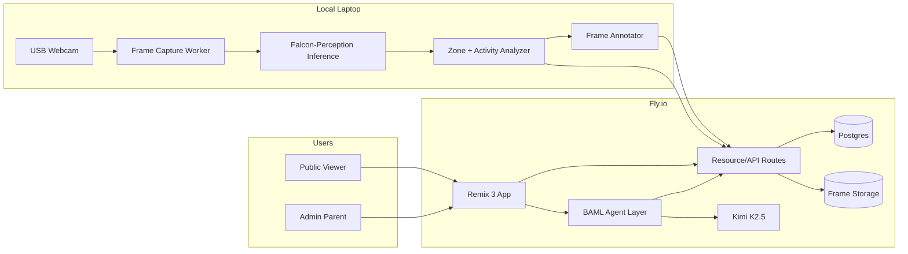

# PRD: BroodCast Live

## 1. Product summary

**BroodCast Live** is a weekend-built, web-based chick monitoring and education app.

A laptop webcam watches a temporary chick brooder. A local vision worker uses **Falcon-Perception** to identify chicks in the camera feed, compute simple location/activity stats, and push observations to a deployed **Remix 3** app on **Fly.io**. Visitors can watch a live annotated stream and ask questions about the chicks through a chatbot powered by **Kimi K2.5** and **BAML**. Admin users log in via **magic link** to configure zones, add manual notes, and generate a class report.

The product is observational only. It does not control heat, food, water, lights, motors, or any physical system.

## 1.1 Current implementation state

As of the current repo state, BroodCast has an end-to-end weekend MVP scaffold inside the existing
RoboSteading site.

Shipped locally:

* The original RoboSteading homepage remains at `/`.
* BroodCast is mounted under `/chickcheck`.
* Public live view exists at `/chickcheck/live`.
* Admin dashboard exists at `/chickcheck/dashboard`.
* Temporary admin token login exists at `/chickcheck/login`.
* Report page exists at `/chickcheck/report`.
* Local file/in-memory persistence stores observations, manual notes, zones, and visibility state.
* Observation ingest APIs are available at both `/api/ingest/observation` and `/chickcheck/api/ingest/observation`.
* Latest/recent observation, chat, manual note, zone, and report APIs exist under `/chickcheck/api/...`.
* Chat uses Fireworks Kimi through `FIREWORKS_API_KEY`, `KIMI_BASE_URL`, and `KIMI_MODEL`, with a conservative local fallback if the API call fails.
* BAML prompt/schema files exist in `baml_src/`, but runtime chat currently calls Fireworks directly.
* Safety docs, weekend runbook, and report template exist in `docs/`.
* A Python worker scaffold exists in `services/inference/`.

Current intentional shortcuts:

* Auth is a temporary token gate, not magic-link auth.
* Persistence is local JSON-backed state under `tmp/`, not Postgres/Supabase.
* The Python worker is a local process, not a server.
* The Python worker can capture webcam frames with OpenCV, but currently uses a fake detector scaffold instead of Falcon-Perception.
* Video is snapshot-based. There is no full video streaming infrastructure.
* The app is not production-hardened; the priority is an end-to-end weekend loop.

## 1.2 Product owner implementation decisions

These decisions supersede the heavier production recommendations elsewhere in this PRD for the
current weekend build:

* Prioritize getting the full loop working end to end over production features.
* Use file/in-memory storage first instead of Supabase/Postgres.
* Use a simple temporary password/token admin gate instead of magic-link auth.
* Build a practical local Python worker scaffold now: webcam capture, fake/manual detector, annotation, and push client.
* Treat Falcon-Perception as a fast follow after webcam-to-Remix is working.
* Keep the local worker as a process that pushes observations to Remix, not as a separate Python web server.
* Use BAML/Kimi as the intended chat stack, with Fireworks Kimi configured through `FIREWORKS_API_KEY`.
* Use `accounts/fireworks/models/kimi-k2p6` as the default Kimi model.
* Keep conservative fallback behavior for chat and detection so the demo works even when model setup is incomplete.

---

# 2. Goals

## Primary goal

Build a working public web app this weekend where parents, kids, and classmates can:

1. View a near-live annotated webcam feed of the chicks.
2. See simple comfort/activity stats.
3. Ask a chatbot questions about what the chicks are doing.
4. Generate a simple “weekend chick care report.”

## Secondary goal

Create a reusable **Robosteading / Null Robot / Divot-style** pattern:

> Observe a real-world activity → annotate it → explain it → coach the human → produce a useful report.

## Non-goals

Do **not** build:

* Automated feeding.
* Automated watering.
* Automated heating control.
* Any actuator inside the brooder.
* Veterinary diagnosis.
* High-accuracy individual chick identity tracking.
* Full production-grade video streaming infrastructure.
* A complex multi-agent orchestration system.
* Native mobile apps.
* Long-term animal-care platform.

---

# 3. Product principles

## 3.1 Null Robot principle

Prefer observation and coaching over physical actuation.

The system should behave like a “robot” because it closes a perception → interpretation → human action loop, not because it moves hardware.

## 3.2 Divot principle

Like a golf swing coach, BroodCast watches the activity and explains what it sees.

For chicks, that means:

* Where are they?
* Are they near the heater?
* Are they eating/drinking?
* Are they active or resting?
* Is there anything a human should check?

## 3.3 Robosteading principle

This is practical household/farm automation for care, learning, and gentle stewardship.

The app should help humans become more attentive caregivers, not replace them.

---

# 4. Target users

## 4.1 Primary users

### Parent/admin

The parent sets up the camera, starts the local worker, checks observations, and manages the public live page.

Needs:

* Simple setup.
* Safety guardrails.
* Magic-link login.
* Ability to add manual notes.
* Ability to generate a report.

### Kids/classmates

They view the live page and ask questions.

Needs:

* Friendly explanations.
* Visual annotations.
* Simple stats.
* Fun but safe learning experience.

### Teacher

Receives a weekend care report.

Needs:

* Summary of chick behavior.
* Evidence that the chicks were monitored.
* Kid-friendly observations.
* No overclaiming or unsafe automation.

---

# 5. User stories

## Public live viewer

1. As a visitor, I can open `/chickcheck/live` and see the latest annotated brooder image.
2. As a visitor, I can see where each chick currently appears to be.
3. As a visitor, I can see a comfort score and recent activity summary.
4. As a visitor, I can ask, “Are the chicks too cold?” and receive a grounded answer based on recent observations.
5. As a visitor, I can ask, “What are they doing right now?” and receive a plain-language explanation.

## Admin

1. As an admin, I can log in using a magic link.
2. As an admin, I can view recent observations and raw stats.
3. As an admin, I can add manual notes such as “checked water at 7:30 PM.”
4. As an admin, I can configure or edit brooder zones.
5. As an admin, I can generate a report for the class.
6. As an admin, I can pause public visibility if needed.

## Local system operator

1. As the operator, I can run a local webcam worker from my laptop.
2. The worker captures frames every 2–5 seconds.
3. The worker runs Falcon-Perception locally against snapshots.
4. The worker sends observation JSON and latest annotated frames to the deployed app.
5. If inference fails, the app still shows the last known frame and a stale-data warning.

---

# 6. Core MVP scope

## Must ship this weekend

### Public `/live`

* Latest image from webcam.
* Chick annotations.
* Chick zone labels.
* Comfort score.
* Recent stats.
* Chatbot panel: “Ask BroodCast.”

### Admin `/dashboard`

* Magic-link login.
* Latest observation.
* Recent observation table.
* Manual note entry.
* Simple zone config editor, even if JSON-based.
* Button/link to generate report.

### Chat agent

* Kimi K2.5 via BAML.
* Typed answer schema.
* Uses:

  * Latest observation.
  * Recent observations.
  * Manual notes.
  * Static chick-care knowledge snippets.
* Returns:

  * Answer.
  * Confidence.
  * Safety level.
  * Suggested checks.
  * Evidence.

### Local vision worker

* Captures webcam frames.
* Runs Falcon-Perception on snapshots.
* Detects chicks using prompt-based segmentation/detection.
* Computes centroid, zone, confidence, basic movement.
* Pushes observations to deployed API.

### Report page

* Summary of weekend observations.
* Comfort score timeline.
* Zone occupancy summary.
* Manual care notes.
* Kid-friendly “what we learned” section.

---

# 7. Safety requirements

## 7.1 Hard safety constraints

The system must never:

* Control heat.
* Control food.
* Control water.
* Control lights.
* Move any object inside the brooder.
* Tell users that chicks are definitely healthy.
* Replace adult supervision.
* Make veterinary diagnoses.
* Recommend risky interventions.

## 7.2 Required safety banner

Display on `/live` and `/dashboard`:

> BroodCast is an observational learning tool. It does not replace adult supervision. Always directly check food, water, temperature, bedding, and chick behavior.

## 7.3 Required agent behavior

The chatbot must always treat concerning situations conservatively.

Set `safety_level = "adult_attention"` when the user asks about or the observations suggest:

* Constant loud peeping.
* Lethargy.
* Injury.
* Wet bedding.
* No movement for a long time.
* No access to food or water.
* Possible overheating.
* Possible chilling.
* Trouble breathing.
* Pasting/pasty butt.
* Chick stuck, trapped, or separated.

## 7.4 Required physical setup rules

Create `docs/SAFETY.md` with:

```md
# BroodCast Safety Rules

- This system is observational only.
- It does not control heat, food, water, doors, motors, lights, or any physical actuator.
- It must not be used as a substitute for adult supervision.
- Any alert is advisory.
- Human caregivers are responsible for checking food, water, temperature, bedding, and chick behavior.
- No wires, electronics, batteries, loose parts, or breadboards go inside the brooder.
- The webcam must be mounted outside or above the brooder.
- The chicks must always be able to freely move toward or away from the heat source.
```

---

# 8. System architecture



---

# 9. Deployment architecture

## 9.1 Local laptop

Runs:

* Webcam capture.
* Falcon-Perception inference.
* Zone/activity analyzer.
* Frame annotation.
* Push client to Fly.io.

Reason: GPU/CPU-heavy vision inference should remain local for weekend MVP.

## 9.2 Fly.io

Runs:

* Remix 3 web app.
* API routes.
* Auth/session handling.
* Chat route.
* Postgres connection.
* Frame upload/read endpoints.

## 9.3 Storage

Original production-oriented options:

### Option A: Postgres + local mounted Fly volume

Simpler, but less portable.

### Option B: Supabase

Recommended for speed:

* Supabase Auth magic links.
* Supabase Postgres.
* Supabase Storage for frames.
* Remix deployed on Fly.io.

### Option C: Neon + R2

Clean production-ish split, more setup.

Original recommended weekend path: **Supabase + Fly.io Remix app**.

Current selected path: **local JSON-backed file/in-memory storage + Remix app**.

Reason: the immediate priority is proving the product loop:

```text
webcam snapshot → local worker analysis → Remix ingest → live view → chat explanation → report
```

Supabase/Postgres can replace the local store after the loop is working.

---

# 10. Pages and routes

Current route namespace: BroodCast is mounted under `/chickcheck` so the original RoboSteading
homepage can remain at `/`.

## 10.1 `/`

RoboSteading landing page with a link to BroodCast.

Content:

* Existing RoboSteading mission content.
* Link to `/chickcheck`.

## 10.2 `/chickcheck/live`

Public page.

Components:

* `LiveStream`
* `ChickOverlay`
* `ChickStatsCards`
* `AskBroodCast`
* `SafetyBanner`
* `RecentObservations`

Required display:

```text
Current status:
- Last updated: X seconds ago
- Chicks detected: 2
- Comfort score: 4/5
- Chick 1: heater zone, resting
- Chick 2: turf zone, active
- Alerts: none
```

If stale:

```text
Stream may be stale. Last observation was 12 minutes ago.
```

## 10.3 `/chickcheck/dashboard`

Admin-only.

Components:

* Authenticated layout.
* Current observation.
* Recent observation table.
* Manual note form.
* Zone config editor.
* Stream health card.
* Report generation link.

## 10.4 `/chickcheck/report`

Public or admin-shareable report page.

Shows:

* Date/time range.
* Total observations.
* Average comfort score.
* Zone distribution.
* Notable events.
* Manual notes.
* Kid-friendly summary.

## 10.5 `/chickcheck/login`

Magic-link login page.

Fields:

* Email input.
* Submit button.
* “Check your email” confirmation state.

## 10.6 `/auth/callback`

Production target: handles magic-link callback.

Current weekend implementation: not used because admin access is a temporary token gate.

---

# 11. API routes

## 11.1 `POST /api/ingest/observation`

Used by local laptop worker.

Auth:

* Requires `STREAM_INGEST_TOKEN`.

Input:

```json
{
  "timestamp": "2026-05-16T10:15:00Z",
  "frame_id": "frame_000123.jpg",
  "annotated_frame_url": "https://...",
  "comfort_score": 4,
  "summary": "Two chicks detected. One near heater, one on turf.",
  "alerts": [],
  "stats": {
    "chick_count": 2,
    "heater_zone_pct_10m": 0.42,
    "food_water_zone_pct_10m": 0.18,
    "movement_score": 0.31
  },
  "detections": [
    {
      "track_id": "chick_1",
      "zone": "heater",
      "bbox": [420, 300, 510, 390],
      "centroid": [465, 345],
      "activity": "resting",
      "confidence": 0.82
    },
    {
      "track_id": "chick_2",
      "zone": "turf",
      "bbox": [610, 350, 700, 440],
      "centroid": [655, 395],
      "activity": "active",
      "confidence": 0.79
    }
  ]
}
```

Response:

```json
{
  "ok": true,
  "observation_id": "uuid"
}
```

## 11.2 `GET /api/latest`

Returns latest observation.

## 11.3 `GET /api/observations?minutes=30`

Returns recent observations.

## 11.4 `POST /api/chat`

Input:

```json
{
  "session_id": "public-session-id",
  "message": "Are the chicks too cold?"
}
```

Output:

```json
{
  "answer": "They may be cool, but the evidence is not conclusive...",
  "confidence": "medium",
  "safety_level": "normal",
  "suggested_checks": [
    "Check the brooder thermometer.",
    "Listen for loud constant peeping.",
    "Make sure both chicks can move away from the heater."
  ],
  "evidence": [
    "Both chicks spent 64% of the last 10 minutes near the heater.",
    "Movement score is low, consistent with resting."
  ],
  "follow_up_questions": [
    "Would you like a bedtime checklist?"
  ]
}
```

## 11.5 `POST /api/manual-notes`

Admin-only.

Input:

```json
{
  "note": "Checked food and water at 7:30 PM. Both full.",
  "visibility": "public"
}
```

## 11.6 `GET /api/report?date=YYYY-MM-DD`

Returns report data.

---

# 12. Database schema

Use Postgres.

```sql
create table users (
  id uuid primary key,
  email text unique not null,
  role text not null default 'viewer',
  created_at timestamptz default now()
);

create table chick_observations (
  id uuid primary key default gen_random_uuid(),
  created_at timestamptz default now(),
  observed_at timestamptz not null,
  frame_id text,
  annotated_frame_url text,
  comfort_score int,
  summary text,
  alerts jsonb not null default '[]',
  stats jsonb not null default '{}'
);

create table chick_detections (
  id uuid primary key default gen_random_uuid(),
  observation_id uuid not null references chick_observations(id) on delete cascade,
  track_id text,
  zone text,
  bbox jsonb,
  centroid jsonb,
  activity text,
  confidence numeric,
  created_at timestamptz default now()
);

create table manual_notes (
  id uuid primary key default gen_random_uuid(),
  created_at timestamptz default now(),
  user_id uuid,
  note text not null,
  visibility text not null default 'private'
);

create table chat_sessions (
  id text primary key,
  user_id uuid,
  created_at timestamptz default now()
);

create table chat_messages (
  id uuid primary key default gen_random_uuid(),
  created_at timestamptz default now(),
  session_id text not null,
  user_id uuid,
  role text not null,
  content text not null,
  citations jsonb not null default '[]',
  metadata jsonb not null default '{}'
);

create table brooder_zones (
  id uuid primary key default gen_random_uuid(),
  name text not null,
  polygon jsonb not null,
  color text,
  active boolean not null default true,
  created_at timestamptz default now(),
  updated_at timestamptz default now()
);
```

---

# 13. Vision worker specification

## 13.1 Location

```text
services/inference/
  capture.py
  falcon_segment.py
  analyze.py
  annotate.py
  stream_client.py
  zones.json
  main.py
  requirements.txt
```

## 13.2 Worker behavior

Loop every 2–5 seconds:

1. Capture frame from webcam.
2. Optionally crop to brooder area.
3. Run Falcon-Perception with chick prompt.
4. Get masks or bounding boxes.
5. Compute centroid for each detection.
6. Assign each centroid to a configured zone.
7. Estimate activity based on movement between recent frames.
8. Compute comfort score.
9. Draw annotations on frame.
10. Upload/push observation to Fly API.

## 13.3 Detection prompt

Start with:

```text
baby chick
```

Fallback prompts:

```text
white chick
baby chicken
small white bird
```

## 13.4 Tracking

Do not overbuild identity tracking.

Use nearest-centroid matching across frames:

```text
previous chick_1 nearest current detection → chick_1
previous chick_2 nearest current detection → chick_2
```

If uncertain, label as:

```text
chick_1
chick_2
unknown_chick
```

## 13.5 Activity classification

Simple heuristic:

```text
movement_delta < threshold_low       => resting
movement_delta between thresholds    => shifting
movement_delta > threshold_high      => active
```

## 13.6 Zone classification

Use polygon point-in-polygon.

Zones:

```json
{
  "zones": [
    {
      "name": "heater",
      "polygon": [[180, 230], [520, 230], [520, 600], [180, 600]]
    },
    {
      "name": "turf",
      "polygon": [[560, 300], [820, 300], [820, 620], [560, 620]]
    },
    {
      "name": "food_water",
      "polygon": [[80, 620], [500, 620], [500, 880], [80, 880]]
    },
    {
      "name": "cool",
      "polygon": [[520, 120], [900, 120], [900, 300], [520, 300]]
    }
  ]
}
```

## 13.7 Comfort score heuristic

Initial simple score:

```text
Start at 4.

-1 if no chicks detected.
-1 if both chicks are in heater zone for >80% of last 10 minutes.
-1 if both chicks are far from heater for >80% of last 10 minutes.
-1 if movement score is near zero for >30 minutes.
-1 if repeated detection confidence <0.4.
+1 if chicks are distributed across safe zones and recent movement is normal.

Clamp to 1–5.
```

This is not a health score. Label it as **comfort signal**, not medical status.

---

# 14. Chat agent specification

## 14.1 Agent name

**Ask BroodCast**

## 14.2 Model

Use **Kimi K2.5/Kimi K2.6** through Fireworks.

Environment variables:

```bash
FIREWORKS_API_KEY=
KIMI_BASE_URL=https://api.fireworks.ai/inference/v1
KIMI_MODEL=accounts/fireworks/models/kimi-k2p6
```

The implementation should keep the model configurable, but the default for this build is
`accounts/fireworks/models/kimi-k2p6`.

Current runtime note:

* The app currently calls the Fireworks completions endpoint directly.
* BAML files are included as the intended prompt/schema source.
* If the Fireworks call fails, the app uses a conservative local fallback answer with the same
  response shape.

## 14.3 BAML files

```text
baml_src/
  clients.baml
  chickcoach.baml
```

## 14.4 `clients.baml`

```baml
client<llm> Kimi {
  provider "openai-generic"
  options {
    base_url env.KIMI_BASE_URL
    api_key env.FIREWORKS_API_KEY
    model env.KIMI_MODEL
  }
}
```

## 14.5 `chickcoach.baml`

```baml
class ChickObservation {
  timestamp string
  comfort_score int
  summary string
  alerts string[]
  heater_zone_pct_10m float
  food_water_zone_pct_10m float
  movement_score float
}

class ChickAnswer {
  answer string
  confidence "low" | "medium" | "high"
  safety_level "normal" | "check_now" | "adult_attention"
  suggested_checks string[]
  evidence string[]
  follow_up_questions string[]
}

function AnswerChickQuestion(
  question: string,
  latest_observation: ChickObservation,
  recent_observations: ChickObservation[],
  manual_notes: string[],
  knowledge_snippets: string[]
) -> ChickAnswer {
  client Kimi
  prompt #"
    You are BroodCast, a cautious educational assistant for a temporary chick brooder.

    Your job:
    - Answer questions about the chicks using the latest observations.
    - Explain chick behavior in simple language.
    - Recommend human checks when appropriate.
    - Never claim to diagnose illness.
    - Never say the system replaces adult supervision.
    - Never tell users to change heat, food, water, or housing without checking conditions directly.
    - If the question involves danger, distress, injury, lethargy, overheating, dehydration, constant loud peeping, or a chick being trapped, set safety_level to adult_attention.

    Latest observation:
    {{ latest_observation }}

    Recent observations:
    {{ recent_observations }}

    Manual notes:
    {{ manual_notes }}

    Chick care knowledge:
    {{ knowledge_snippets }}

    User question:
    {{ question }}
  "#
}
```

## 14.6 Chat response UI

Render as:

```text
Answer

Evidence
- ...
- ...

Suggested checks
- ...
- ...

Safety level
Normal / Check now / Adult attention
```

## 14.7 Knowledge snippets

Create static snippets in:

```text
app/data/chick-care-kb.ts
```

Include short, conservative, sourced-in-spirit care facts such as:

* Chicks need access to a warm area and a cooler area.
* Huddling near heat can indicate cold or resting.
* Avoiding heat can indicate overheating.
* Loud constant peeping can indicate distress.
* Food, water, bedding, and temperature should be checked directly.
* The system cannot diagnose health issues.

Keep snippets short. Do not make the model rely on internet access during the weekend MVP.

---

# 15. Auth specification

## 15.1 Requirement

Production target: use magic-link login for admin functionality.

Current weekend implementation: use a temporary password/token gate.

## 15.2 Recommended implementation

Original recommendation: use Supabase Auth magic links.

Current selected implementation: use `ADMIN_TOKEN` for a simple admin session cookie.

Admin-only routes:

* `/dashboard`
* `/api/manual-notes`
* `/api/zones`
* report generation controls
* stream visibility controls

Public routes:

* `/`
* `/live`
* `/report` if explicitly shared
* `/api/latest`
* `/api/chat`, rate-limited

## 15.3 Authorization

Only allow emails in an allowlist to become admin.

Environment variable:

```bash
ADMIN_EMAILS=parent@example.com,teacher@example.com
```

---

# 16. Frontend component specification

## 16.1 `LiveStream`

Props:

```ts
type LiveStreamProps = {
  imageUrl: string | null;
  lastUpdatedAt: string | null;
  stale: boolean;
};
```

Behavior:

* Shows latest annotated image.
* Shows stale warning if last update is older than threshold.
* Refreshes every 2–5 seconds or subscribes via SSE.

## 16.2 `ChickStatsCards`

Props:

```ts
type ChickStatsCardsProps = {
  comfortScore: number | null;
  chickCount: number;
  movementScore: number | null;
  alerts: string[];
};
```

## 16.3 `AskBroodCast`

Props:

```ts
type AskBroodCastProps = {
  sessionId: string;
};
```

Behavior:

* User enters question.
* Calls `/api/chat`.
* Renders structured answer.

## 16.4 `ObservationTimeline`

Shows recent observations in reverse chronological order.

Columns:

* Time.
* Chick count.
* Comfort score.
* Summary.
* Alerts.

## 16.5 `ManualNoteForm`

Admin-only.

Fields:

* Note.
* Visibility: private/public.
* Submit.

## 16.6 `SafetyBanner`

Required on public and admin pages.

---

# 17. Repo structure

```text
chickcoach-live/
  apps/
    web/
      app/
        components/
          AskBroodCast.tsx
          ChickOverlay.tsx
          ChickStatsCards.tsx
          LiveStream.tsx
          ManualNoteForm.tsx
          ObservationTimeline.tsx
          SafetyBanner.tsx
        data/
          chick-care-kb.ts
        lib/
          auth.server.ts
          db.server.ts
          observations.server.ts
          chat.server.ts
          baml.server.ts
          report.server.ts
        routes/
          _index.tsx
          live.tsx
          dashboard.tsx
          login.tsx
          auth.callback.tsx
          report.tsx
          api.chat.ts
          api.latest.ts
          api.observations.ts
          api.ingest.observation.ts
          api.manual-notes.ts
        styles/
          app.css
      baml_src/
        clients.baml
        chickcoach.baml
      package.json
      Dockerfile
      fly.toml

  services/
    inference/
      main.py
      capture.py
      falcon_segment.py
      analyze.py
      annotate.py
      stream_client.py
      zones.json
      requirements.txt
      README.md

  docs/
    PRD.md
    SAFETY.md
    WEEKEND_RUNBOOK.md
    CLASS_REPORT_TEMPLATE.md

  scripts/
    dev-web.sh
    dev-worker.sh
    deploy-fly.sh
```

---

# 18. Environment variables

## Web app

```bash
APP_URL=

ADMIN_TOKEN=

FIREWORKS_API_KEY=
KIMI_BASE_URL=https://api.fireworks.ai/inference/v1
KIMI_MODEL=accounts/fireworks/models/kimi-k2p6

STREAM_INGEST_TOKEN=
```

Production fast-follow variables, when replacing local storage/auth:

```bash
DATABASE_URL=
SESSION_SECRET=
SUPABASE_URL=
SUPABASE_ANON_KEY=
SUPABASE_SERVICE_ROLE_KEY=
ADMIN_EMAILS=
```

## Local worker

```bash
CHICKCOACH_API_URL=
STREAM_INGEST_TOKEN=
CAMERA_INDEX=0
CAPTURE_INTERVAL_SECONDS=3
FALCON_MODEL=tiiuae/Falcon-Perception
```

---

# 19. Weekend implementation plan

## Friday night: skeleton and local proof

### Backend/web

* Create Remix 3 app.
* Add Fly deployment config.
* Add Supabase/Postgres connection.
* Create DB schema.
* Add `/live` page.
* Add `/api/ingest/observation`.
* Add `/api/latest`.

### Local worker

* Capture webcam frame.
* Save latest frame locally.
* Send fake observation to web app.
* Verify `/live` updates.

Acceptance criteria:

* `/live` renders latest fake frame and stats.
* Local worker can push observation JSON.

---

## Saturday morning: vision loop

* Install Falcon-Perception dependencies.
* Run detection/segmentation on one saved brooder frame.
* Generate annotated image.
* Compute chick centroids.
* Add `zones.json`.
* Compute zone labels.
* Push real observations to API.

Acceptance criteria:

* App shows latest annotated chick image.
* App shows chick count and zone labels.
* Comfort score updates.

---

## Saturday afternoon: chat agent

* Add BAML.
* Configure Kimi.
* Implement `AnswerChickQuestion`.
* Add static chick-care KB.
* Add `/api/chat`.
* Add `AskBroodCast` component.

Acceptance criteria:

* User can ask: “Are they too cold?”
* Agent uses latest observations.
* Agent returns structured answer with evidence and suggested checks.

---

## Saturday evening: auth and dashboard

* Add magic-link login.
* Add admin allowlist.
* Add `/dashboard`.
* Add manual notes.
* Show recent observations.
* Add stream health display.

Acceptance criteria:

* Admin can log in.
* Admin can add a manual note.
* Chat answers include manual notes.

---

## Sunday morning: report

* Add `/report`.
* Summarize observations.
* Include manual notes.
* Include comfort score timeline.
* Include kid-friendly summary.
* Add export/print styling.

Acceptance criteria:

* Report can be shown or printed for class.
* Report includes stats and notes from the weekend.

---

## Sunday afternoon: polish and safety

* Add safety banner everywhere.
* Add stale-stream warning.
* Add error handling for no chick detected.
* Add rate limit for chat.
* Add basic logging.
* Add runbook.

Acceptance criteria:

* App survives worker crash.
* Public page degrades gracefully.
* Safety language is visible.
* No unsafe automation exists.

---

# 20. Acceptance criteria

## Functional acceptance

The MVP is complete when:

1. A public user can visit `/live`.
2. The page shows a recent annotated image of the brooder.
3. The page shows chick count, zone labels, and comfort score.
4. A user can ask the chatbot a question.
5. The chatbot answers using latest observation data.
6. Admin can log in via magic link.
7. Admin can add manual notes.
8. A report page summarizes the weekend.
9. Local worker can be stopped/restarted without breaking the app.
10. The app displays a stale-data warning when updates stop.

## Safety acceptance

The MVP is acceptable only if:

1. No hardware actuation is implemented.
2. No electronics are placed inside the brooder.
3. The chatbot does not diagnose health issues.
4. The chatbot recommends direct adult checks for concerning scenarios.
5. Public pages include an explicit supervision disclaimer.
6. The system labels scores as “comfort signals,” not health status.

---

# 21. Engineering notes

## 21.1 Do not stream full video first

Use snapshot-based near-live updates every 2–5 seconds.

This is simpler, cheaper, easier to debug, and enough for chick monitoring.

## 21.2 Do not overbuild identity

With two similar chicks, persistent identity may be unreliable.

Use temporary track IDs based on nearest centroid.

## 21.3 Do not block the UI on model calls

The live view should update independently of chat.

## 21.4 Do not put Codex in the runtime care loop

Codex can inspect logs and propose improvements, but it should not make care decisions.

Optional post-MVP Codex workflow:

```text
Every 15 minutes:
- Inspect recent observation logs.
- Identify low-confidence detections.
- Suggest prompt/config improvements.
- Generate a short system health summary.
```

---

# 22. Initial design direction

Visual style:

* Warm.
* Educational.
* Household robotics, not clinical monitoring.
* Simple cards.
* Large image.
* Minimal controls.

Suggested copy:

```text
BroodCast Live

A tiny observational farm robot for learning how chicks behave.

This system watches the brooder, labels what it sees, and helps humans ask better questions. It does not replace adult care.
```

Stats card labels:

```text
Comfort signal
Chicks detected
Near heater
Near food/water
Movement
Last updated
```

Chat placeholder:

```text
Ask about the chicks...
```

Example quick prompts:

```text
Are they too cold?
What are they doing right now?
Have they been eating?
What should we check before bedtime?
Can you explain this for kids?
```

---

# 23. Risks and mitigations

| Risk                            | Likelihood | Impact | Mitigation                                             |
| ------------------------------- | ---------: | -----: | ------------------------------------------------------ |
| Falcon setup is slow            |     Medium |   High | Use fake detector or manual bounding boxes as fallback |
| Webcam angle poor               |       High | Medium | Crop image and manually configure zones                |
| Chick detection confidence low  |     Medium | Medium | Use fallback prompts and lower update frequency        |
| Fly deployment takes time       |     Medium | Medium | Deploy only Remix; keep inference local                |
| Magic-link auth slows team      |     Medium | Medium | Use Supabase Auth                                      |
| Chat overclaims                 |     Medium |   High | Strict BAML schema and safety prompt                   |
| Public stream stale             |       High |    Low | Add stale warning                                      |
| Similar chicks confuse tracking |       High |    Low | Do not promise stable identity                         |

---

# 24. Fallback plan

If Falcon-Perception is too hard to run this weekend, ship the app with:

1. Webcam snapshots.
2. Manual chick annotations.
3. Zone stats entered manually.
4. Chatbot using manual notes + latest image summary.

Fallback observation input:

```json
{
  "summary": "Both chicks are resting near the heater.",
  "comfort_score": 4,
  "stats": {
    "chick_count": 2,
    "heater_zone_pct_10m": 0.7,
    "movement_score": 0.2
  },
  "detections": []
}
```

This still proves the product loop:

```text
Observe → annotate → explain → coach → report
```

---

# 25. Definition of done

The project is done for the weekend when:

* The public page works.
* The webcam worker sends real or fallback observations.
* The chatbot answers questions using recent chick context.
* Admin login works.
* Manual notes work.
* The report page works.
* Safety docs exist.
* No unsafe automation exists.
* The class can see a simple report explaining what happened over the weekend.

---

# 26. Next work: Python webcam and model worker

The next development priority is the Python side of the system.

Goal:

> Make the local Python worker reliably turn webcam frames into useful BroodCast observations.

Work next on:

* Confirming webcam capture works on the target laptop.
* Adding a simple preview/debug mode so camera framing can be adjusted quickly.
* Saving raw and annotated frames locally for troubleshooting.
* Making zone calibration practical, likely by editing `services/inference/zones.json` against a real frame.
* Replacing the fake detector in `services/inference/falcon_segment.py` with the first Falcon-Perception integration.
* Keeping a manual/fake detector fallback so the Remix app remains usable while model setup is in progress.
* Improving activity scoring from centroid movement across recent frames.
* Making push failures visible and recoverable instead of silently losing frames.
* Documenting the exact worker startup command for real webcam mode and fake-camera mode.

Acceptance criteria for the next pass:

* The worker can run for at least 10 minutes without crashing.
* `/chickcheck/live` updates from real webcam snapshots.
* Annotated frames show chick boxes, labels, and zones.
* Observation JSON includes chick count, centroid, zone, activity, confidence, comfort signal, and summary.
* If Falcon-Perception fails, the worker continues using a fallback path and the web app shows stale or degraded data clearly.
